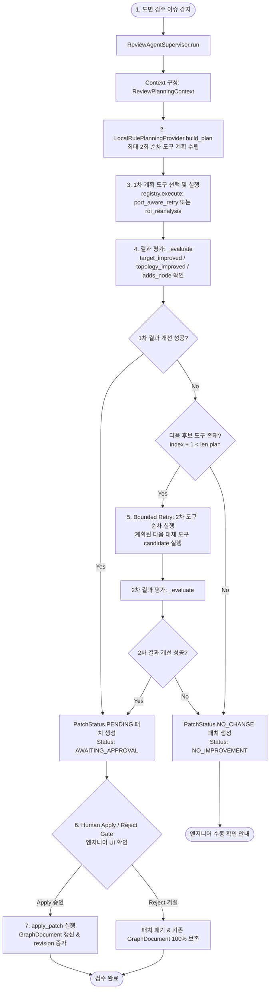

# 🤖 PowerLens Agentic Review Workflow

> **문서 버전**: v1.1.0 (2026-09-22)  
> **관련 대회 트랙**: 제17회 전력산업 소프트웨어 경진대회·AI 경진대회 — 'Agentic AI 활용 문제해결 및 생산성 향상'  
> **기준 코드베이스**: [`backend_api/agent/supervisor.py`](backend_api/agent/supervisor.py), [`backend_api/agent/tool_registry.py`](backend_api/agent/tool_registry.py), [`backend_api/agent/review_planning_provider.py`](backend_api/agent/review_planning_provider.py), [`backend_api/agent/providers.py`](backend_api/agent/providers.py), [`backend_api/review/`](backend_api/review/)

---

## 1. 개요 및 해결하려는 문제 (Problem Statement)

전력 계통 단선도(Single-Line Diagram, SLD)는 발전기, 변압기, 모선, 송전선로, 부하 등 복잡한 설비 기호와 고유 식별 번호가 얽혀 있는 고밀도 엔지니어링 도면입니다.  
기존의 단순 End-to-End 비전 모델이나 일회성 검출 파이프라인은 다음과 같은 한계를 지닙니다.

1. **복합 도면 노이즈**: 도면 스캔 품질 저하, 기호 중첩, 텍스트와 결선 선로의 중첩으로 인한 국소 오탐/미탐.
2. **모호 결선 및 단선 위상 결함**: 굴절 선로, T-분기, 다회선 결선 부근에서 전기적 연결 관계가 모호해져 조류계산 입력 행렬($Y_{\text{bus}}$) 구성 시 특이 행렬(Singular Matrix) 유발.
3. **도면-제원 불일치**: 단선도 작도 내용과 계통 파라미터 엑셀 파일(.xlsx) 간 설비 누락 및 명칭 불일치.

PowerLens는 이를 해결하기 위해 **결정론적 상태 관리자(`ReviewAgentSupervisor`)**, **경계가 명확한 규칙 기반 플래너(`LocalRulePlanningProvider`)**, **등록된 특화 비전 도구(`ReviewToolRegistry`)**, **엄격한 평가 및 2회 제한 재시도(`MAX_AGENT_ATTEMPTS=2`)**, **패치 프리뷰(`PatchPreview`) 및 인간 승인 게이트(Human Apply/Reject)**, 그리고 **별도의 독립된 Gemini Lensy Assistant**로 구성된 실용적이고 안전한 Agentic Review Workflow를 구현했습니다.

---

## 2. 에이전트 목표 (Agent Goal)

- **도면 토폴로지 완전 무결성 확보**: 국소 ROI 재분석(`roi_reanalysis`)과 포트 인식 선로 재추적(`port_aware_retry`)을 통해 모호 결선과 미탐 객체를 단계적으로 해소.
- **안전한 패치 기반 자율 수정 (Safety Guarantee)**: AI 에이전트가 도면 데이터를 즉시 덮어쓰지 않고, 변경 전후 diff와 근거를 담은 `PatchPreview`를 생성하여 엔지니어의 최종 승인(Human Apply/Reject)을 거쳐 확정.
- **결정론적 제어와 생성형 어시스턴트의 엄격한 분리**: 검수 계획과 도구 실행은 외부 API 의존 없이 100% 로컬 결정론적 파이프라인으로 수행하고, Gemini 모델은 별도의 대화형 안내 및 보조 진단 역할로만 한정.

---

## 3. 입력 데이터 (Inputs)

| 입력 항목 | 소스 및 타입 | 설명 |
| :--- | :--- | :--- |
| **도면 이미지 및 ROI 에셋** | `AnalysisAsset` | 원본 도면 이미지 및 분석 에셋 |
| **`GraphDocument`** | `GraphDocument` | 노드(`nodes`), 선로(`edges`), 포트(`ports`), 이슈 목록(`issues`), 문서 버전(`revision`) |
| **검수 이슈 (`ReviewIssue`)** | `ReviewIssue` | 검출된 이슈 코드(`issue.code`), 영향 컴포넌트(`component_ids`), 심각도(`severity`) |

---

## 4. 에이전트 실행 수명주기 (Agent Lifecycle)

PowerLens의 Review Agent는 **Observe $\rightarrow$ Plan $\rightarrow$ Tool Selection $\rightarrow$ Execute $\rightarrow$ Evaluate $\rightarrow$ Bounded Retry $\rightarrow$ Patch Preview $\rightarrow$ Human Apply/Reject Gate $\rightarrow$ GraphDocument Update** 순서로 동작합니다.

---

## 5. 단계별 상세 구현 및 코드 메커니즘

### 1) 관측 및 컨텍스트 구성 (Observe & Context)
- **코드 위치**: [`backend_api/agent/supervisor.py`](backend_api/agent/supervisor.py) (`ReviewAgentSupervisor._context()`)
- 대상 이슈(`ReviewIssue`)의 코드와 영향 노드를 분석하고, 연결 차수(`_degrees`) 및 열린 이슈 통계를 수집하여 [`ReviewPlanningContext`](backend_api/agent/review_planning_provider.py)를 생성합니다.

### 2) 계획 수립 (Plan)
- **코드 위치**: [`backend_api/agent/review_planning_provider.py`](backend_api/agent/review_planning_provider.py) (`LocalRulePlanningProvider.build_plan()`)
- **실제 구현 구조**:
  - `ReviewPlanningProvider` (추상 기본 클래스)
  - `LocalRulePlanningProvider` (실제 기본 구현체)
  - `ReviewPlanningContext` (플래닝 컨텍스트 데이터 클래스)
- `ReviewAgentSupervisor`의 기본 provider는 `LocalRulePlanningProvider`이며, **외부 API나 LLM 호출 없이 완전히 로컬 규칙으로 최대 2회(`MAX_AGENT_ATTEMPTS = 2`)의 실행 계획(`list[AgentPlanStep]`)을 수립**합니다.
- 이슈 유형에 따른 도구 우선순위:
  - 결선/포트 관련 이슈(`invalid_terminal_degree`, `disconnected_generator` 등): `port_aware_retry` $\rightarrow$ `roi_reanalysis` 순
  - 객체 누락/고립 모선 관련 이슈(`isolated_bus`, `missing_object_candidates` 등): `roi_reanalysis` $\rightarrow$ `port_aware_retry` 순

### 3) 등록된 에이전트 도구 (ReviewToolRegistry)
- **코드 위치**: [`backend_api/agent/tool_registry.py`](backend_api/agent/tool_registry.py)
- **Supervisor가 실제로 실행 가능한 등록 도구는 정확히 아래 2개입니다**:
  1. **`port_aware_retry`**: 기존 포트 인식과 실제 픽셀 선로 추적을 대상 이슈 주변에서 재실행하여 결선 복원.
  2. **`roi_reanalysis`**: 기존 Vision/CV 파이프라인을 이슈 국소 ROI에서 재실행하여 대체 객체 검출 후보 확인.
- 도구 실행 시 [`backend_api/agent_tools/vision_tools.py`](backend_api/agent_tools/vision_tools.py)의 `ReviewVisionToolRunner.create_preview()`를 호출하여 `PatchPreview`를 생성합니다.

> [!NOTE]
> **별도 검수 및 진단 기능과의 구분**:  
> 프로젝트 내의 다음 기능들은 `ReviewToolRegistry`의 에이전트 등록 도구가 아니며, 별도의 검수 단계 및 진단 모듈로 동작합니다:
> - **중복 노드 병합**: 1단계 객체 검수 파이프라인의 NMS 및 IoU 필터링 로직에서 처리.
> - **모선 번호 연계 (`link_and_validate_bus_numbers`)**: 2단계 모선 매핑 라우터 및 [`backend_api/core/bus_number_linker.py`](backend_api/core/bus_number_linker.py)에서 별도 실행.
> - **위상 무결성 검증 (`validate_topology_rules`)**: [`backend_api/core/electrical_topology.py`](backend_api/core/electrical_topology.py) 및 `validate_graph()`에서 독립 검증.
> - **엑셀 제원 불일치 진단 (`diagnose_excel_discrepancy`)**: 4단계 엑셀 대조 모달 및 [`backend_api/agent/excel_discrepancy_agent.py`](backend_api/agent/excel_discrepancy_agent.py)에서 독립 진단.

### 4) 결과 평가 메커니즘 (Result Evaluation)
- **코드 위치**: [`backend_api/agent/supervisor.py`](backend_api/agent/supervisor.py) (`ReviewAgentSupervisor._evaluate()`)
- 도구 실행 결과 생성된 `PatchPreview`의 가상 적용본을 생성하고, 전후 토폴로지 이슈를 정량 평가합니다:
  - `target_improved`: 대상 이슈 건수가 감소했는가 (`target_after < target_before`)
  - `topology_improved`: 가중치 기반 전체 토폴로지 점수가 개선되었는가 (`after_score < before_score`)
  - `adds_node`: 누락 객체 이슈 해결을 위해 유효 노드가 추가되었는가
- 위 조건 중 하나 이상을 충족하고 가상 그래프 검증에 성공할 경우 `improved = True`로 판정합니다.

### 5) Bounded Retry 정책 (최대 2회 순차 후보 실행)
- **상수 정의**: `MAX_AGENT_ATTEMPTS = 2`
- **동작 방식**:
  - 첫 번째 도구 실행 후 `improved == True`이면 루프를 즉시 중단하고 해당 패치를 사용자 승인 대기 상태로 전달합니다.
  - 첫 번째 도구 결과가 개선되지 않았고(`improved == False`), 계획된 다음 도구 후보(`index + 1 < len(plan)`)가 존재하면 계획의 2번째 도구를 1회 추가 시도합니다.
  - 최대 2회 시도 후에도 개선 후보를 찾지 못하면 `PatchStatus.NO_CHANGE` 상태의 패치를 생성하고 `AgentRunStatus.NO_IMPROVEMENT`로 종료합니다. 임의의 무한 재시도나 파라미터 강제 확장은 수행하지 않습니다.

### 6) 패치 프리뷰 생성 (Patch Preview)
- **코드 위치**: [`backend_api/review/patches.py`](backend_api/review/patches.py) (`PatchPreview`)
- 에이전트 실행 결과는 즉시 원본 데이터를 변형하지 않고 `PatchPreview` 객체로 격리됩니다:
  - `patch_id`: 고유 식별자
  - `tool_name`: 실행된 도구명 (`port_aware_retry` 또는 `roi_reanalysis`)
  - `status`: `PatchStatus.PENDING` (개선 성공 시) 또는 `PatchStatus.NO_CHANGE`
  - `operations`: 구체적 변경 작업 목록 (`add_node`, `remove_node`, `add_edge`, `remove_edge` 등)
  - `summary`: 엔지니어가 확인할 수 있는 한글 요약 설명

### 7) 인간 승인 게이트 (Human Apply / Reject Gate)
- **프론트엔드 UI**: [`frontend_app/lib/screens/review_page.dart`](frontend_app/lib/screens/review_page.dart)
- **백엔드 API**: [`backend_api/review/api.py`](backend_api/review/api.py)
  - `POST /review/apply_patch`: 엔지니어가 승인(Apply)하면 패치의 `operations`가 실제 `GraphDocument`에 반영되고 리비전 번호가 증가합니다.
  - `POST /review/reject_patch`: 엔지니어가 거절(Reject)하면 패치가 폐기되고 기존 도면 상태가 100% 그대로 보존됩니다.

---

## 6. 결정론적 Supervisor와 Gemini Assistant의 명확한 역할 분리

PowerLens는 안전성이 최우선인 전력 계통 공학의 특성을 반영하여, **감독자(Supervisor)는 100% 로컬 결정론적 파이프라인으로 구동**하고, **Gemini 모델은 인터랙티브 어시스턴트(Lensy AI) 및 보조 진단으로만 분리**했습니다.

| 구분 | 결정론적 Supervisor (`ReviewAgentSupervisor`) | Gemini Lensy Assistant (`GeminiReviewAssistantProvider`) |
| :--- | :--- | :--- |
| **역할 정의** | 도면 이슈 관측, 도구 실행 계획 수립, 도구 실행, 정량 평가, 재시도 제어, 패치 생성 | 엔지니어의 자연어 질문 응답, 작업 단계별 가이드, UI 버튼 네온 하이라이트 타깃 추천 |
| **플래닝 방식** | [`LocalRulePlanningProvider`](backend_api/agent/review_planning_provider.py) 기반 로컬 규칙 계획 (LLM 미사용) | 대화 컨텍스트 기반 프롬프트 생성 (Supervisor 플래닝에 개입하지 않음) |
| **사용 도구** | `port_aware_retry`, `roi_reanalysis` (엄격히 제한된 2개 도구) | UI 네온 점등 타깃 지정 (`glowing_target_wrapper.dart`) |
| **모델 설정** | 해당 없음 (로컬 Python 로직) | `gemini-3.5-flash-lite` (`GEMINI_MODEL` 환경변수로 변경 가능) |
| **타임아웃** | 해당 없음 | `TIMEOUT_SECONDS = 25.0` ([`providers.py:716`](backend_api/agent/providers.py)) |
| **실행 환경** | 오프라인 로컬 환경에서 100% 자립 구동 | API 키 부재 시 [`LocalReviewAssistantProvider`](backend_api/agent/providers.py)로 자동 폴백 |

---

## 7. 프로젝트 내 Gemini 모델 사용 현황 (Code Truth)

코드베이스 전수 분석 결과 확인된 실제 Gemini 모델 구성입니다:

| 소스 파일 경로 | 기본 모델 식별자 | 환경변수 오버라이드 | 기능 및 역할 |
| :--- | :--- | :--- | :--- |
| [`backend_api/agent/providers.py`](backend_api/agent/providers.py) | `gemini-3.5-flash-lite` | `GEMINI_MODEL` | Lensy AI 대화형 어시스턴트 및 UI 하이라이트 타깃 추천 (타임아웃 25초) |
| [`backend_api/core/bus_number_linker.py`](backend_api/core/bus_number_linker.py) | `gemini-3.5-flash` | - | Set-of-Mark(B1, B2...) 크롭 콜라주 기반 모선 번호 시각적 판독 (실패 시 `gemini-3.5-flash-lite` 폴백) |
| [`backend_api/agent/excel_discrepancy_agent.py`](backend_api/agent/excel_discrepancy_agent.py) | `gemini-3.5-flash-lite` | `GEMINI_MODEL` | 도면-엑셀 제원 간 불일치 원인 분석 및 단계별 권장 조치사항 생성 |
| [`backend_api/agent/object_reviewer.py`](backend_api/agent/object_reviewer.py) | `gemini-3.5-flash-lite` | `GEMINI_MODEL` | 단일 심볼 객체 검수 시 시각적 근거 설명 생성 |

---

## 8. 구현 소스 코드 대응표 (Source Mapping)

| 워크플로우 구성 요소 | 소스 코드 파일 경로 | 핵심 클래스 및 함수 |
| :--- | :--- | :--- |
| **에이전트 총괄 감독자** | [`backend_api/agent/supervisor.py`](backend_api/agent/supervisor.py) | `ReviewAgentSupervisor`, `run()`, `_evaluate()` |
| **플래닝 인터페이스 및 규칙 구현** | [`backend_api/agent/review_planning_provider.py`](backend_api/agent/review_planning_provider.py) | `ReviewPlanningProvider`, `LocalRulePlanningProvider`, `ReviewPlanningContext` |
| **도구 레지스트리 (2개 등록 도구)** | [`backend_api/agent/tool_registry.py`](backend_api/agent/tool_registry.py) | `ReviewToolRegistry`, `RegisteredReviewTool`, `ToolCandidate` |
| **특화 비전 도구 실행기** | [`backend_api/agent_tools/vision_tools.py`](backend_api/agent_tools/vision_tools.py) | `ReviewVisionToolRunner.create_preview()` |
| **패치 프리뷰 및 연산 모델** | [`backend_api/review/patches.py`](backend_api/review/patches.py) | `PatchPreview`, `PatchOperation`, `PatchStatus` |
| **세션 및 그래프 문서 저장소** | [`backend_api/review/store.py`](backend_api/review/store.py) | `GraphDocument`, `ReviewStore`, `AnalysisAsset` |
| **검수 및 패치 적용 REST API** | [`backend_api/review/api.py`](backend_api/review/api.py) | `/review/apply_patch`, `/review/reject_patch` |
| **인간 승인 검수 UI 화면** | [`frontend_app/lib/screens/review_page.dart`](frontend_app/lib/screens/review_page.dart) | `_showPatchPreviewModal()`, `_applyPatch()`, `_rejectPatch()` |
| **대화형 어시스턴트 프로바이더** | [`backend_api/agent/providers.py`](backend_api/agent/providers.py) | `GeminiReviewAssistantProvider`, `LocalReviewAssistantProvider` |
