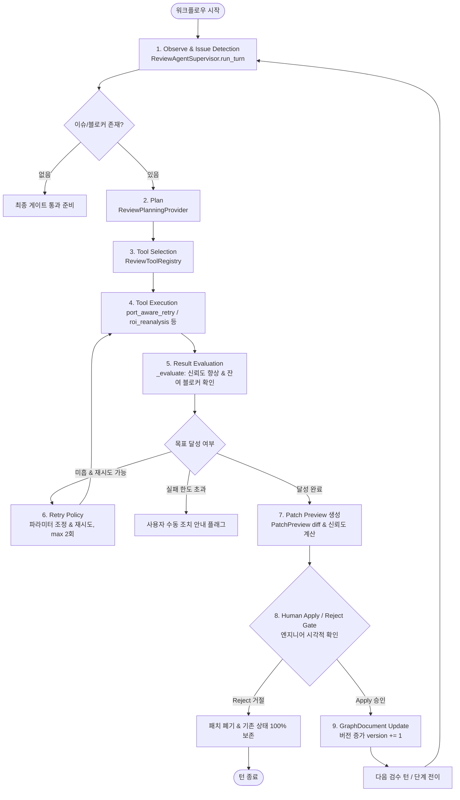

# 🤖 PowerLens Agentic Review Workflow

> **문서 버전**: v1.0.0 (2026-09-22)  
> **관련 대회 트랙**: 제17회 전력산업 소프트웨어 경진대회·AI 경진대회 — 'Agentic AI 활용 문제해결 및 생산성 향상'  
> **기준 코드베이스**: `backend_api/agent/`, `backend_api/review/`, `frontend_app/lib/screens/review_page.dart`

---

## 1. 개요 및 해결하려는 문제 (Problem Statement)

전력 계통 단선도(Single-Line Diagram, SLD)는 발전기, 변압기, 모선, 송전선로, 부하 등 다양한 설비 기호와 고유 식별 번호가 복잡하게 얽혀 있는 고밀도 엔지니어링 도면입니다.  
기존의 단순 End-to-End 비전 모델이나 단발성 OCR 파이프라인은 다음과 같은 본질적 한계를 지닙니다.

1. **복합적 도면 노이즈**: 도면 스캔 품질 저하, 기호 중첩, 텍스트와 결선 선로의 겹침으로 인한 오탐/미탐 발생.
2. **모호 결선 및 단선 위상 결함**: 굴절 선로, T-분기, 다회선 결선 부근에서 전기적 연결 관계가 모호해져 조류계산 입력 행렬($Y_{\text{bus}}$) 구성 시 특이 행렬(Singular Matrix)을 유발.
3. **도면-제원 불일치**: 실제 단선도 작도 내용과 계통 파라미터 엑셀 파일(.xlsx) 간 설비 누락, 명칭 불일치, 동기조상기 등가성 차이 발생.

PowerLens는 이러한 문제를 해결하기 위해 **결정론적 상태 머신 감독자(Deterministic Supervisor)**와 **상황 인지형 Gemini LLM 보조자**, 그리고 **실제 도구 실행 및 인간 승인 게이트(Human-in-the-Loop)**가 유기적으로 결합된 **Agentic Review Workflow**를 구축했습니다.

---

## 2. 에이전트 목표 (Agent Goal)

- **도면 토폴로지 완전 무결성 확보**: 저신뢰도 객체 재탐색, 모호 결선 자동 추적 및 토폴로지 규칙 검증을 통해 완전한 `GraphDocument`를 구성.
- **안전한 패치 기반 자율 수정**: AI가 도면 데이터를 임의로 즉시 덮어쓰지 않고, 명확한 변경 근거와 diff를 담은 `PatchPreview`를 생성한 후 엔지니어의 최종 확인(Apply/Reject)을 거쳐 확정.
- **공학적 파라미터 Source of Truth 보존**: 도면 토폴로지와 엑셀 제원 간의 오차를 스스로 진단하고 피드백을 제공하여 조류계산 수치해석 솔버로 전달되는 입력의 무결성을 보장.

---

## 3. 입력 데이터 (Inputs)

에이전트 워크플로우는 다음 3가지 핵심 입력을 기반으로 구동됩니다.

| 입력 항목 | 데이터 타입 / 소스 | 설명 |
| :--- | :--- | :--- |
| **도면 이미지** | 래스터 이미지 (`.png`, `.jpg`, `.pdf`) | 최초 업로드된 원본 도면 파일 및 단계별 고해상도 ROI 크롭 |
| **`GraphDocument`** | JSON / 메모리 세션 스토어 | 노드(`ReviewNodeItem`), 선로(`ReviewLineItem`), 메타데이터, 버전 번호(`version`) |
| **계통 엑셀 데이터** | `.xlsx` 파일 | 모선(BUS), 선로(BRANCH), 발전기(GEN), 변압기(TRANSFORMER) 전기 파라미터 |

---

## 4. 에이전트 실행 수명주기 (Agent Lifecycle & State Transition)

PowerLens의 에이전트는 **Observe $\rightarrow$ Plan $\rightarrow$ Tool Selection $\rightarrow$ Execute $\rightarrow$ Evaluate $\rightarrow$ Retry $\rightarrow$ Patch Preview $\rightarrow$ Human Apply/Reject Gate $\rightarrow$ GraphDocument Update**의 엄격한 폐루프(Closed-Loop) 사이클을 준수합니다.

---

## 5. 단계별 상세 실행 메커니즘

### 1) Observe & Issue Detection (관측 및 이슈 감지)
- **주체**: [`ReviewAgentSupervisor.run_turn()`](file:///c:/Users/dptjd/Downloads/PowerLens/backend_api/agent/supervisor.py)
- **동작**:
  - 현재 활성화된 세션의 `GraphDocument`를 읽어와 단계(Stage)별 이슈를 스캔합니다.
  - 객체 검수 단계: 신뢰도 미달(`confidence < threshold`), `SUSPICIOUS` 상태, 바운딩 박스 종횡비 결함, 중복 바운딩 박스(IoU > 0.35).
  - 결선 검수 단계: `review_status == "AMBIGUOUS"`인 선로, 단자 연결 미완료 선로, 고립 모선(Isolated Bus), 단선 선로.
  - 엑셀 대조 단계: 모선 번호 결측, 선로 양단 모선 불일치.

### 2) Plan (계획 수립)
- **주체**: [`ReviewPlanningProvider`](file:///c:/Users/dptjd/Downloads/PowerLens/backend_api/agent/review_planning_provider.py)
- **구현 방식 (하이브리드)**:
  - **`LocalRulePlanningProvider` (기본/결정론적 엔진)**:
    - 외부 네트워크나 API 키 없이도 규칙 기반으로 즉각적인 액션 시퀀스를 도출.
    - 예: 미확정 노드가 존재하면 `roi_reanalysis` 우선 계획, 모호 결선이 존재하면 `port_aware_retry` 우선 계획.
  - **`GeminiReviewPlanningProvider` (지능형 보조 엔진)**:
    - 복합 이슈 상황에서 도면 컨텍스트를 프롬프트로 구성하여 Gemini 모델로부터 구조화된 계획 수신.
    - API 타임아웃 또는 JSON 파싱 오류 시 안전하게 `LocalRulePlanningProvider`로 자동 폴백.

### 3) Tool Selection (도구 선택)
- **주체**: [`ReviewToolRegistry`](file:///c:/Users/dptjd/Downloads/PowerLens/backend_api/agent/tool_registry.py)
- 수립된 계획(`AgentActionPlan`)의 요구사항에 따라 등록된 특화 도구를 매핑합니다.

| 등록 도구명 | 핵심 기능 | 구현 위치 |
| :--- | :--- | :--- |
| `port_aware_retry` | 단자 근접 포트 반경 및 스켈레톤 탐색 파라미터를 조정하여 모호 선로 재추적 | [`vision_tools.py`](file:///c:/Users/dptjd/Downloads/PowerLens/backend_api/agent/vision_tools.py) |
| `roi_reanalysis` | 저신뢰도 또는 누락 의심 영역에 대해 특화 CV 필터 및 YOLO 재검출 수행 | [`vision_tools.py`](file:///c:/Users/dptjd/Downloads/PowerLens/backend_api/agent/vision_tools.py) |
| `merge_duplicate_nodes` | 동일 설비에 대해 중복 생성된 바운딩 박스를 IoU 기반으로 병합 정리 | [`tool_registry.py`](file:///c:/Users/dptjd/Downloads/PowerLens/backend_api/agent/tool_registry.py) |
| `auto_link_bus_numbers` | OCR 번호 검출 박스와 모선 간 투영 근접도를 재계산하여 번호 자동 할당 | [`bus_number_linker.py`](file:///c:/Users/dptjd/Downloads/PowerLens/backend_api/core/bus_number_linker.py) |
| `validate_topology_rules` | 폐루프, 슬랙 모선 유무, 변압기 단자 적합성 등 전기공학적 토폴로지 검증 | [`electrical_topology.py`](file:///c:/Users/dptjd/Downloads/PowerLens/backend_api/core/electrical_topology.py) |
| `diagnose_excel_discrepancy` | 도면 검수 결과와 엑셀 시트 설비 목록 간의 차이점 및 원인 분석 | [`excel_discrepancy_agent.py`](file:///c:/Users/dptjd/Downloads/PowerLens/backend_api/agent/excel_discrepancy_agent.py) |

### 4) Tool Execution (도구 실행)
- 선택된 도구를 실제 실행 파라미터와 함께 호출합니다.
- 예: `port_aware_retry` 실행 시 대상 선로 ID, 시작 노드, 끝 노드, 포트 허용 반경(`search_radius_px`)을 인자로 전달하여 픽셀 경로를 재탐색합니다.

### 5) Result Evaluation (결과 평가)
- **주체**: `ReviewAgentSupervisor._evaluate()`
- **평가 지표**:
  - 도구 실행 후 검출 신뢰도가 임계값 이상으로 상승했는가?
  - 모호 선로(`AMBIGUOUS`)가 유효 연결(`DETECTED`)로 전환되었는가?
  - 해당 조치로 인해 새로운 토폴로지 결함(예: 단선 모선 발생)이 유발되지 않았는가?
  - 평가 결과는 `RESOLVED`, `PARTIALLY_RESOLVED`, `UNRESOLVED`로 판정됩니다.

### 6) Retry Policy (재시도 및 적응 제어)
- `_evaluate()` 결과가 `UNRESOLVED` 또는 `PARTIALLY_RESOLVED`인 경우, 최대 **2회(`max_retries = 2`)**까지 재시도합니다.
- 재시도 시 파라미터를 적응적으로 완화/확장합니다 (예: 선로 탐색 반경 15px $\rightarrow$ 25px $\rightarrow$ 35px).
- 2회 초과 시에는 무한 루프를 방지하기 위해 즉시 중단하고, 엔지니어가 수동으로 수정할 수 있도록 에스컬레이션 플래그(`requires_human_intervention: true`)를 설정합니다.

### 7) Patch Preview (패치 프리뷰 생성)
- **핵심 원칙**: 자율 에이전트의 실행 결과는 즉시 원본 데이터에 적용되지 않습니다.
- 도구 실행 결과를 바탕으로 [`PatchPreview`](file:///c:/Users/dptjd/Downloads/PowerLens/backend_api/agent/patches.py) 객체를 생성합니다:
  - `patch_id`: 고유 식별자
  - `patch_type`: `NODE_UPDATE`, `LINE_RECONNECT`, `NODE_MERGE`, `BUS_RENUMBER`
  - `description`: 엔지니어가 이해하기 쉬운 변경 사유 요약 (한국어)
  - `diff`: 변경 전(`before`) 및 변경 후(`after`)의 상세 속성
  - `confidence_gain`: 조치 전후의 신뢰도 변화량

### 8) Human Apply / Reject Gate (인간 승인/거절 게이트)
- **위치**: 프론트엔드 UI ([`review_page.dart`](file:///c:/Users/dptjd/Downloads/PowerLens/frontend_app/lib/screens/review_page.dart))
- 엔지니어는 화면에 시각적으로 표시된 패치 프리뷰(변경된 바운딩 박스, 수정된 선로 경로 등)를 확인합니다.
- **[승인 (Apply)]**: `/review/apply_patch` 호출 $\rightarrow$ 패치가 실제 도면 모델에 반영됩니다.
- **[거절 (Reject)]**: `/review/reject_patch` 호출 $\rightarrow$ 패치가 폐기되며 도면은 기존 상태 그대로 100% 안전하게 유지됩니다.

### 9) GraphDocument Update (문서 상태 갱신)
- 승인된 패치는 [`ReviewSessionStore`](file:///c:/Users/dptjd/Downloads/PowerLens/backend_api/review/store.py)의 `GraphDocument`에 불변(Immutable) 방식으로 복제 반영됩니다.
- 문서 버전 번호가 1 증가(`version += 1`)하여 추적성을 보장하고 다음 검수 턴의 기반 데이터로 사용됩니다.

---

## 6. 결정론적 Supervisor와 Gemini Assistant의 역할 분리

PowerLens의 핵심 아키텍처는 **"결정론적 제어(Deterministic Control)"**와 **"생성형 언어 지능(Generative Intelligence)"**을 명확히 분리하여 안전성과 사용성을 극대화한 구조입니다.

| 구분 | 결정론적 감독자 (`ReviewAgentSupervisor`) | Gemini AI 보조자 (`Lensy AI` / `API Provider`) |
| :--- | :--- | :--- |
| **역할 정의** | 전체 에이전트 워크플로우의 안전한 실행 통제 및 상태 관리 | 도면 맥락 해석, 엔지니어 질의응답, 복합 원인 설명 |
| **상태 전이 제어** | 상태 머신 기반 (게이트 통과 요건, 완료 여부 판단 전담) | 상태 전이를 직접 강제하지 않음 (조언 및 가이드 제공) |
| **도구 실행 권한** | 도구 호출 권한 검증, 재시도 횟수 제한(2회), 에러 핸들링 | 사용자 의도에 맞는 도구 추천 및 파라미터 제안 |
| **수정본 반영 방식** | `PatchPreview` 생성 후 엔지니어의 `Apply` 승인 시에만 반영 | 직접 데이터를 덮어쓰지 않음 (환각 데이터 유입 차단) |
| **오프라인 동작** | 외부 통신 없이 로컬 파이썬 환경에서 100% 자립 구동 | API Key 부재 또는 통신 불가 시 로컬 규칙으로 자동 대체 |
| **주요 코드 파일** | `backend_api/agent/supervisor.py` `backend_api/review/staged_api.py` | `backend_api/agent/providers.py` `backend_api/agent/excel_discrepancy_agent.py` |

---

## 7. 오류 처리 및 불확실성 관리 정책 (Failure & Uncertainty Policy)

1. **LLM 환각 및 응답 지연 방어**:
   - Gemini API 호출 타임아웃은 8초로 제한되며, 타임아웃 발생 시 즉시 `LocalRulePlanningProvider`의 결과로 폴백합니다.
   - LLM 응답 포맷이 올바른 JSON 스키마를 만족하지 않을 경우, 정규식 추출 파서를 거치고 실패 시 로컬 기본값으로 복구합니다.
2. **도구 실행 실패 격리**:
   - `port_aware_retry` 또는 `roi_reanalysis` 도중 OpenCV/비전 예외가 발생하더라도 전체 세션이 크래시되지 않으며, 해당 도구 결과만 `FAILED`로 기록되고 이전 `GraphDocument` 상태를 보존합니다.
3. **인간 최종 결정권 (Human Authority)**:
   - AI 에이전트의 어떠한 자동 추천이나 패치도 엔지니어의 확인 없이 단독으로 확정되지 않습니다.
   - 4단계 검수 게이트(Gate 1~4)의 최종 승인은 오직 엔지니어의 명시적 클릭을 통해서만 통과할 수 있습니다.

---

## 8. 코드 구현 대응표 (Implementation Source Mapping)

| 구성 요소 | 소스 코드 파일 경로 | 핵심 클래스 및 함수 |
| :--- | :--- | :--- |
| **에이전트 총괄 감독자** | `backend_api/agent/supervisor.py` | `ReviewAgentSupervisor`, `run_turn()`, `_evaluate()` |
| **플래닝 공급자** | `backend_api/agent/review_planning_provider.py` | `ReviewPlanningProvider`, `LocalRulePlanningProvider`, `GeminiReviewPlanningProvider` |
| **도구 레지스트리** | `backend_api/agent/tool_registry.py` | `ReviewToolRegistry`, `execute_tool()` |
| **패치 모델** | `backend_api/agent/patches.py` | `PatchPreview`, `PatchType`, `apply_patch()` |
| **특화 비전 도구** | `backend_api/agent/vision_tools.py` | `port_aware_retry()`, `roi_reanalysis()` |
| **세션 및 문서 저장소** | `backend_api/review/store.py` | `GraphDocument`, `ReviewSessionStore` |
| **검수 게이트 REST API** | `backend_api/review/api.py`, `staged_api.py` | `/review/detect_objects`, `/review/apply_patch`, `/review/verify_final_gate` |
| **불일치 진단 에이전트** | `backend_api/agent/excel_discrepancy_agent.py` | `diagnose_excel_discrepancy()` |
| **사용자 게이트 UI** | `frontend_app/lib/screens/review_page.dart` | `_showPatchPreviewModal()`, `_applyPatch()`, `_rejectPatch()` |
| **AI 어시스턴트 패널** | `frontend_app/lib/widgets/powerlens_ai/` | `powerlens_ai_panel.dart`, `glowing_target_wrapper.dart` |
