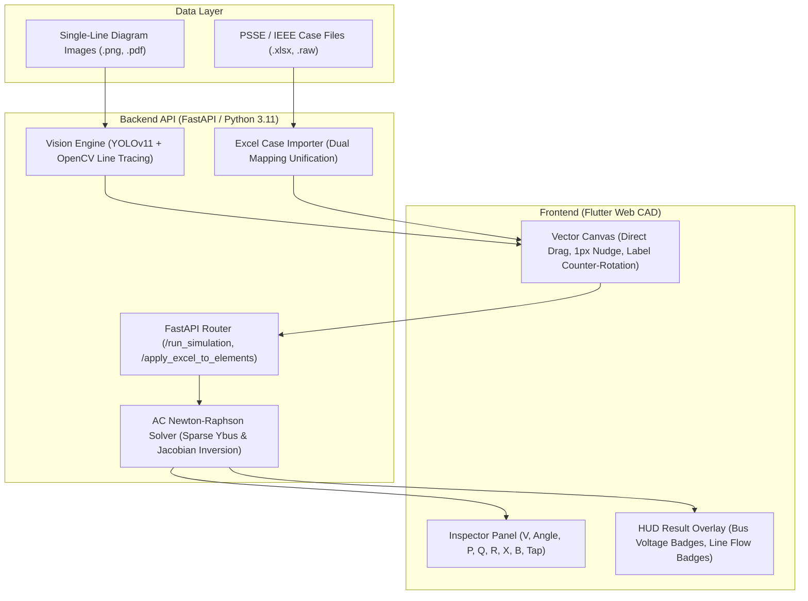

# ⚡ PowerLens Pro (전력계통 AI 단선도 인식 및 조류계산 플랫폼)

<div align="center">


**AI 기반 전력 단선도(Single-Line Diagram) 자동 객체 인식 및 고성능 AC Newton-Raphson 조류계산 웹 CAD 플랫폼**

[프로젝트 개요](#-프로젝트-개요) • [핵심 기술 성과](#-핵심-엔지니어링-성과) • [시스템 아키텍처](#-시스템-아키텍처) • [검증 및 벤치마크](#-수치해석-검증-및-성능) • [빠른 시작 가이드](#-빠른-시작-가이드)

</div>

---

## 📌 프로젝트 개요 (Executive Summary)

전력 계통 해석(Power System Analysis) 분야에서 수십 모선 이상의 전력망 데이터를 구축하려면 단선도(Single-Line Diagram) 도면을 보고 수작업으로 모선 번호, 송전선로 임피던스, 발전기/부하 제원 등을 수치해석 툴(PSS/E, ETAP 등)에 일일이 타이핑해야 했습니다. 이 과정은 수 시간 이상의 노동을 필요로 하며 휴먼 에러로 인한 계통 해석 오류를 빈번하게 유발합니다.

**PowerLens Pro**는 이러한 문제를 해결하기 위해 개발된 **지능형 전력 엔지니어링 웹 CAD & 수치해석 솔루션**입니다.
1. **Computer Vision 파이프라인**: 래스터 도면 이미지에서 모선(Bus), 발전기(Gen), 부하(Load), 변압기(Tr), 선로(Line)를 자동 탐지하고 위상 토폴로지를 추출합니다.
2. **PC 마우스 최적화 순수 Web CAD Canvas**: Figma/AutoCAD 수준의 직접 드래그앤드롭, 방향키 초정밀 미세 정렬(1px/10px Nudge), 90도 회전(R 키) 및 글자 가독성 100% 역회전 보정 기능을 지원합니다.
3. **자체 구현 Full AC Newton-Raphson 수치해석 엔진**: PSS/E 기준 3모선 및 IEEE 24-bus RTS 표준 계통에서 허용 오차 $10^{-4}$ 이하, 4회 반복 내 무오차 수렴과 완벽한 물리적 전력 균형($\sum P_{\\text{gen}} = \sum P_{\\text{load}} + \sum P_{\\text{loss}}$)을 보장합니다.

---

## 🏆 핵심 엔지니어링 성과 (Technical Highlights)

### 1. 🧠 AI Vision 기반 단선도 토폴로지 자동 복원
- **YOLOv11 + OpenCV 하이브리드 객체 인식**: 모선·부하·변압기는 형태와 전기적 연결 조건을 우선 검사하고, YOLOv11은 발전기 탐지와 CV 후보 보완에 활용하여 숫자·접지기호·거대 박스 오검출을 억제.
- **객체 검출 성능 검증**: 26장 별도 정답셋에서 로컬 YOLO 체크포인트와 CV 보정 파이프라인이 IoU 0.40 기준 **Precision 98.07%, Recall 97.95%, F1 98.01%** 기록.
- **포트 인식 기반 선로 추적**: 이진화·스켈레톤화와 실제 선 픽셀 경로 추적을 결합하여 직선·굴절·교차 선로를 분석하고, 각 객체의 유효 연결 포트와 도착 모선을 자동 매핑.
- **전기적 토폴로지 검증**: 모선의 다중 연결, 부하·발전기의 단일 인입선, 변압기의 방향별 독립 포트를 반영하여 검출 결과를 편집 가능한 `nodes`/`lines` 그래프로 변환.

### 2. ⚡ 자체 개발 Full AC Newton-Raphson 전력 조류계산 솔버
- **정밀 복소 어드미턴스 행렬($Y_{\\text{bus}}$) 구축**: 송전선로 $\\pi$-등가회로의 병렬 서셉턴스(B/2), 변압기 탭비(Tap Ratio) 오프노미널 모델링 완전 지원.
- **야코비안(Jacobian) 행렬 방정식 계산**: $\\begin{bmatrix} \\Delta P \\\\ \\Delta Q \\end{bmatrix} = \\begin{bmatrix} J_{11} & J_{12} \\\\ J_{21} & J_{22} \\end{bmatrix} \\begin{bmatrix} \\Delta \\theta \\\\ \\Delta |V| \\end{bmatrix}$ 반복 수렴 알고리즘을 NumPy 벡터화 연산으로 최적화.
- **산업 표준 검증**: IEEE 24-bus RTS 계통에서 **4회 반복(Iteration)** 만에 최대 잔차 $4 \\times 10^{-8}$ 수준으로 초정밀 수렴.

### 3. 🎨 순수 PC 마우스 CAD 인터랙션 체계 구축 (Flutter Web)
- **Direct Drag & Tight Hitbox**: 14px의 미세한 조작 핸들을 조준해야 했던 구형 방식을 탈피하여, 심볼 몸체를 마우스로 직접 잡아 실시간 드래그앤드롭. 주변 인접 클릭을 방해하던 200px 투명 마진을 전면 제거하고 기하학적 정밀 바운딩 박스 구현.
- **키보드 단축키 정렬 체계**:
  - `↑ / ↓ / ← / →`: 1px 초정밀 단위 심볼 정렬 (텍스트 필드 포커스 시 커서 이동 자동 분기)
  - `Shift + 방향키`: 10px 쾌속 이동
  - `R 키`: 즉각 90도 회전
  - `Ctrl + Z / Ctrl + Y`: 상태 복원 및 재실행
  - `Space / F`: 도면 전체 화면 맞춤 (Zoom to Fit)
- **심볼 회전 시 글자 역회전(Counter-Rotation) 보정**: 부하 화살표나 변압기가 90°/180°/270°로 회전하더라도 라벨 텍스트와 발전기 기호(`G`, `S`, `SC`)는 화면 기준 완벽한 수평(정방향, Left-to-Right)으로 가독성을 100% 유지.
- **선로 개수 정밀 동기화**: 발전기/부하 인입선(Feeder Leads)을 스마트하게 제외하고, 실제 송전선로 및 변압기 선로(34개 브랜치)만 상단 배지와 인스펙터에 일원화 표시.

### 4. 🔗 Dual Mapping 해소 및 클린 아키텍처 리팩토링
- 프론트엔드와 백엔드에 분산되어 있던 중복 엑셀 파서(770줄)를 백엔드(`ExcelCaseImporter`)로 완전 일원화하여 수치 불일치 원천 차단.
- 단일 거대 파일(4,750줄)이었던 `main.dart`에서 `InspectorPanel`(1,350줄)과 도면 모델(`DrawingElement`)을 독립 모듈로 추출하여 유지보수성 극대화.

---

## 🏗️ 시스템 아키텍처 (System Architecture)



---

## 🧪 수치해석 검증 및 성능 (Benchmark Validation)

### IEEE 24-bus RTS / PSS/E 실제 계통 수렴 검증

| 항목 | 계산 결과 | 비고 |
| :--- | :--- | :--- |
| **모선 수 (Buses)** | 24개 | 슬랙 모선: #1 (1.0 pu, 0.0°) |
| **유효 브랜치 수 (Branches)** | 34개 | 송전선로 29개 + 탭 변압기 5개 (인입선 제외) |
| **발전기 수 (Generators)** | 11기 | 동기조상기(SC) 포함 |
| **수렴 반복 횟수 (Iterations)** | **4회** | 허용 오차: $10^{-4}$ (최대 잔차: $4 \times 10^{-8}$) |
| **총 발전량 (Total Generation)** | **1,694.655 MW** / -44.542 MVAR | 유효/무효 전력 완전 수렴 |
| **총 부하량 (Total Load)** | **1,672.000 MW** / 336.000 MVAR | 계통 수요 100% 충족 |
| **총 전력 손실 (Total Loss)** | **22.655 MW** / -380.542 MVAR | $\sum P_{\\text{gen}} - \sum P_{\\text{load}} = P_{\\text{loss}}$ 무오차 성립 |

---

## 📁 디렉토리 구조 (Directory Structure)

```bash
PowerLens/
├── backend_api/                 # 백엔드 API 및 해석 엔진
│   ├── core/
│   │   ├── power_flow_solver.py # AC Newton-Raphson 조류계산기 코어
│   │   └── excel_case_importer.py # 엑셀 파라미터 백엔드 일원화 파서
│   ├── sample_cases/            # 표준 검증 케이스 (ac_case25.xlsx, case24_psse.xlsx)
│   ├── tests/                   # 자동화 단위 테스트 슈트
│   └── main_server.py           # FastAPI 메인 서버 엔트리포인트
├── frontend_app/                # Flutter Web CAD 프론트엔드
│   ├── lib/
│   │   ├── models/              # 도면 요소 모델 (drawing_element.dart)
│   │   ├── widgets/             # 분리된 UI 컴포넌트 (inspector_panel.dart 등)
│   │   ├── screens/             # 리뷰 및 캔버스 화면
│   │   └── main.dart            # 벡터 캔버스 및 마우스/키보드 CAD 인터랙션
│   └── web/                     # 웹 빌드 아티팩트
├── main_server.py               # 루트 서버 실행 스크립트
└── README.md                    # 프로젝트 문서
```

---

## 🚀 빠른 시작 가이드 (Quick Start)

### 1. 요구 사항 (Prerequisites)
- Python 3.11+
- Flutter 3.19+ (Web 지원)
- Google Chrome 또는 최신 웹 브라우저

### 2. 백엔드 서버 실행
```bash
# 가상환경 활성화 및 의존성 설치
pip install -r backend_api/requirements.txt

# FastAPI 백엔드 서버 실행 (포트 8000)
python main_server.py
```
- API 문서(Swagger UI): [http://localhost:8000/docs](http://localhost:8000/docs)

### 3. 프론트엔드 웹 앱 실행
```bash
# 방법 A: 프로덕션 빌드 서빙 (권장)
python -m http.server 58640 --directory frontend_app/build/web

# 방법 B: Flutter Web 디버그 모드 실행
cd frontend_app
flutter run -d chrome --web-port 58640
```
- 웹 브라우저에서 [http://localhost:58640](http://localhost:58640) 접속

### 4. 단위 테스트 실행
```bash
# 조류계산기 및 수치 정합성 테스트
python backend_api/tests/test_power_flow_solver.py
```

---

## 📄 라이선스 (License)

This project is licensed under the MIT License.
