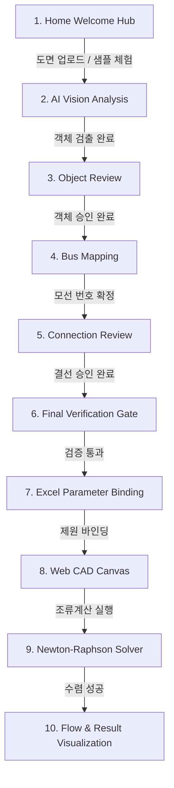

# PowerLens Team Handoff
> Start here before modifying code.

이 문서는 **PowerLens Pro(전력계통 AI 단선도 인식 및 조류계산 플랫폼)** 프로젝트의 현재 최신 상태와 아키텍처, 실행/테스트 방법, 그리고 새로 합류한 팀원이 즉시 작업을 이어받을 수 있는 모든 인수인계 정보를 담고 있는 **공식 핸드오프 문서**입니다.

코드나 설정을 수정하기 전에 반드시 이 문서와 프로젝트 루트의 [`POWERLENS_AGENT_RULES.md`](./POWERLENS_AGENT_RULES.md)를 정독해 주십시오.

---

## 6-A. PROJECT SUMMARY (프로젝트 개요)

PowerLens는 전기 엔지니어가 수작업으로 수시간 동안 도면을 보고 타이핑하던 계통 모델링 과정을 혁신하는 **지능형 전력 엔지니어링 웹 CAD & 수치해석 솔루션**입니다.

### End-to-End 파이프라인
```
[단선도 래스터 이미지 (PNG/JPG)]
  ↓ (1. Vision Detection: YOLOv11 + OpenCV 하이브리드 추적)
[검출 설비 후보 (Bus, Gen, Load, Tr) + 선로 연결 그래프]
  ↓ (2. Object Review: 저신뢰도/의심 객체 순차 집중 검토)
[승인된 설비 목록]
  ↓ (3. Bus Mapping: Set-of-Mark + Gemini Vision 번호 매칭 + 모선 집중 검토)
[모선 번호가 확정된 노드]
  ↓ (4. Connection Review: 결선 순차 검토 + 토폴로지 무결성 검증)
[결선 검증 완료]
  ↓ (5. Deterministic Validation Gate: 최종 전기적/구조적 유효성 검사)
[Verified SLD (검증된 단선도 구조)]
  ↓ (6. Excel Parameter Binding: 백엔드 ExcelCaseImporter 기반 제원 바인딩)
[AC 계통 파라미터가 부여된 회로]
  ↓ (7. Interactive Web CAD: 직접 드래그앤드롭, 1px/10px Nudge, 라벨 역회전 보정)
[CAD 캔버스 편집]
  ↓ (8. Newton-Raphson Power Flow: 정밀 복소 Ybus & Jacobian 수치해석)
[선로 조류 흐름 방향(➔) 및 모선 전압/선로 조류 결과 오버레이]
```

### Agentic AI & Human-in-the-Loop 아키텍처
PowerLens의 AI 어시스턴트 **Lensy**는 단순한 FAQ 챗봇이 아닙니다:
- **Vision 엔진(YOLO/OpenCV)**과 **수치해석 엔진(Newton-Raphson)**의 실제 결과 및 현재 앱의 상태(Screen, Stage, Selection, Issues)를 관찰(Observe)합니다.
- 검증 근거가 부족하거나 모호한 연결이 있을 때만 사람에게 확인을 요청(Human-in-the-Loop)합니다.
- 사용자가 "나 이제 뭐 해?", "계산 진행", "결과 보여줘"와 같은 일상 자연어로 명령하면 앱 UI 액션을 안전한 브리지(`PowerLensAIService`)를 통해 직접 실행합니다.

---

## 6-B. PRODUCT PHILOSOPHY (제품 철학 및 원칙)

1. **Web-First Flutter Single Application**:
   - 별도의 데스크톱/모바일 앱을 따로 분리하지 않고, 동일한 Flutter Web App에서 동작합니다.
   - 메인 타깃은 데스크톱 웹이지만, 동일 URL에서 태블릿 및 모바일 브라우저에서도 직관적으로 사용할 수 있는 Adaptive UX를 지향합니다.
2. **Beginner-Friendly UX & One Primary Action**:
   - 내부 엔지니어링 용어나 복잡한 JSON/토폴로지 용어를 외우지 않아도 처음 사용하는 사람이 설명서 없이 직관적으로 다음 단계를 알 수 있어야 합니다.
   - 각 화면마다 가장 중요한 **Primary Action CTA**는 가급적 1개로 명확히 제시합니다.
3. **엄격한 기술 분업 (Separation of Concerns)**:
   - **YOLOv11 + OpenCV**: 도면 픽셀 인식 및 물리적 선로 추적 (Vision Evidence).
   - **Deterministic Validator**: 전기적 법칙, 연결 위상, 절연/고립 모선 검증 (Structural Evidence).
   - **Newton-Raphson Engine**: $Y_{\text{bus}}$ 및 야코비안 행렬 기반 실수치 조류계산 (Numerical Engine).
   - **Gemini / Lensy**: 파이프라인 관찰, 상황 추론, 엔지니어링 가이드 및 자연어 브리지 (Reasoning & Orchestration Layer).
   - **절대 금지**: Gemini가 근거 없는 바운딩 박스를 날조하거나, 수치 조류계산 결과를 임의로 지어내서는 안 됩니다.
4. **Human-in-the-Loop 원칙**:
   - 설비 삭제, 클래스 변경, 모선 번호 수정, 결선 변경 등 계통 토폴로지를 변경하는 핵심 행위는 사용자의 명시적 승인 하에 실행됩니다.
5. **에이전트 4단계 판정 기준**:
   - `PROCEED`: 결함 없음, 다음 단계 진행 안내.
   - `HUMAN CHECK`: 의심스럽거나 신뢰도가 낮은 항목만 선별하여 사용자 검토 요청.
   - `BLOCK`: 전기적 모순(쇼트, 고립 모선 등) 발견 시 사유 명시 및 해결 방법 안내.
   - `UNKNOWN`: 근거 부족 시 추측하지 않고 사용자 확인 요청.

---

## 6-C. REPOSITORY / BRANCH (저장소 및 브랜치 정보)

- **원격 저장소**: [https://github.com/dptjddl285-ship-it/Powerflow-calculator](https://github.com/dptjddl285-ship-it/Powerflow-calculator)
- **기본 브랜치**: `master` (직접 수정 및 직접 머지 금지)
- **팀 작업 브랜치**: `feat/ux-agent-foundation`
- **베이스 커밋**: `b93acef` (Docs: 실시간 진행 상태 및 백그라운드 투명성 보고 규칙 수립)
- **인계 커밋 내역**:
  1. `46b9237`: `[Feat] PowerLens Agent 및 검수 UX 최신 상태 반영` (제품 소스코드, 모델/컨텍스트, 테스트, 샘플 도면 및 엑셀 픽스처)
  2. `[Docs] PowerLens 팀 인수인계 문서 추가` (`TEAM_HANDOFF.md`, README 링크, 대표 스크린샷 8종)

---

## 6-D. DIRECTORY MAP (핵심 디렉토리 구조 및 역할)

```
Powerflow-calculator/
├── backend_api/                     # FastAPI 기반 백엔드 및 전력계통 해석 엔진
│   ├── agent/                       # Lensy AI 에이전트 프로바이더 (Gemini / Local Fallback)
│   ├── agent_tools/                 # 도면 상태 조회 및 의심 객체 추출 도구
│   ├── core/                        # 전력조류계산 코어 (Newton-Raphson, Ybus, Excel Importer)
│   ├── icon_recognition/            # YOLOv11 심볼 검출 모델 및 가중치 (*.pt)
│   ├── review/                      # 검수 세션 관리 및 단계별 게이트 API (staged_api.py)
│   ├── sample_cases/                # IEEE 24-bus, 3-bus 등 표준 도면 및 엑셀 픽스처
│   ├── tests/                       # 백엔드 pytest 단위 테스트 슈트 (96개)
│   ├── main_server.py               # FastAPI 서버 엔트리포인트 (포트 8000)
│   └── requirements.txt             # 백엔드 파이썬 의존성 패키지 목록
├── frontend_app/                    # Flutter Web 프론트엔드 CAD 플랫폼
│   ├── lib/
│   │   ├── models/                  # DrawingElement, VerifiedSLD, AssistantContext 데이터 모델
│   │   ├── screens/                 # review_page.dart (단계별 검수실 화면)
│   │   ├── services/                # powerlens_ai_service.dart (Lensy 브리지 및 인텐트 파서)
│   │   ├── widgets/                 # inspector_panel, review_overlay, home/ 등 UI 컴포넌트
│   │   │   └── powerlens_ai/        # Lensy 로봇 캐릭터 위젯, 플로팅 버튼, 어시스턴트 패널
│   │   └── main.dart                # 인터랙티브 CAD 캔버스, 조류계산 연동, 흐름 방향 가시화
│   ├── build/web/                   # 프로덕션 Flutter Web 빌드 아티팩트 (원클릭 실행용 추적)
│   └── test/                        # Flutter 위젯 및 AI 서비스 인텐트 테스트
├── docs/                            # 프로젝트 공식 문서 및 핸드오프 자료
│   └── handoff/screenshots/         # 8대 대표 검증 화면 스크린샷 모음
├── main_server.py                   # 루트 위치 편의용 백엔드 실행 스크립트
├── run_powerlens.py                 # 백엔드+웹서버 동시 구동 및 브라우저 자동 실행 런처
├── run_powerlens.bat                # Windows 사용자용 더블클릭 실행 배치 파일
├── case24_psse.xlsx                 # IEEE 24-bus 표준 PSS/E 계통 제원 샘플 엑셀
├── 검사사진.jpg                     # IEEE 24-bus 테스트 단선도 샘플 이미지
├── .env.example                     # 백엔드 환경변수 설정 템플릿 (키 미포함)
├── POWERLENS_AGENT_RULES.md         # 프로젝트 전역 에이전트/개발 불변 규칙 (Source of Truth)
├── PROGRESS_REPORT.md               # 5대 핵심 UX 요구사항 완료 보고서
└── TEAM_HANDOFF.md                  # (본 문서) 신규 팀원 인수인계 가이드
```

---

## 6-E. CURRENT WORKFLOW (실제 사용자 전체 흐름)



1. **Home (Welcome Hub)**:
   - 입력: 3대 핵심 액션 카드 선택 (`[도면 사진으로 시작]`, `[샘플 도면으로 체험]`, `[직접 회로도 그리기]`).
   - 자동 처리: 샘플 클릭 시 24-bus 표준 회로 자동 로드.
   - Human 확인: 작업 방식 선택.
   - 다음 Gate: 도면 파일 선택 완료.
2. **Vision Analysis (백그라운드)**:
   - 자동 처리: YOLOv11 심볼 인식 + OpenCV 스켈레톤 선로 추적.
   - 다음 Gate: 세션 생성 완료 (`/review/init_session`).
3. **Object Review (객체 검수)**:
   - 입력: 검출된 설비 목록 및 신뢰도 점수.
   - 자동 처리: 저신뢰도/의심 객체 자동 최우선 정렬.
   - Human 확인: 1개씩 순차 카드 검토 및 필터 칩 탐색.
   - 다음 Gate: 전체 의심 객체 승인 완료.
4. **Bus Mapping (모선 번호 검수)**:
   - 입력: Set-of-Mark + Gemini Vision 판독 모선 번호 후보.
   - 자동 처리: 모선 집중 모드 (선택 모선 외 12% 투명도 감쇄).
   - Human 확인: `# Bus #X` 영웅 배지 및 자동 판독 추천 칩 승인 (Enter 키 지원).
   - 다음 Gate: 모든 모선 번호 부여 완료.
5. **Connection Review (결선 검수)**:
   - 입력: 선로 연결 그래프.
   - 자동 처리: 선로 집중 모드 (선택 선로 네온 사이언 글로우, 비단자 라벨 숨김).
   - Human 확인: `GEN 1 ⟷ Bus 18` 양단 연결 확인 및 토폴로지 무결성 검증.
   - 다음 Gate: 결선 최종 승인.
6. **Final Verification Gate (회로 최종 검증)**:
   - 자동 처리: Deterministic 토폴로지/전기적 무결성 전수 검사.
   - Human 확인: 검증 결과 요약 카드 확인.
   - 다음 Gate: `VerifiedSLD` JSON 생성.
7. **Excel Import (계통 제원 바인딩)**:
   - 입력: PSS/E 포맷 Excel 파일 (`case24_psse.xlsx`).
   - 자동 처리: `ExcelCaseImporter`를 통한 임피던스(R, X, B), 발전/부하 용량(P, Q), 슬랙/PV/PQ 모선 속성 자동 주입.
   - 다음 Gate: 바인딩 요약 확인 후 `[캔버스로 이동]`.
8. **CAD Canvas (회로도 인터랙티브 편집)**:
   - 조작: 심볼 마우스 직접 드래그, 1px 미세 정렬(방향키), 10px 쾌속 이동(Shift+방향키), 90도 회전(R 키, 라벨 역회전 보정).
   - 다음 Gate: `[조류계산 실행]` 버튼 또는 Lensy에게 "계산 진행".
9. **Power Flow (Newton-Raphson 해석)**:
   - 자동 처리: 백엔드 `/run_simulation` 호출. 복소 어드미턴스 행렬($Y_{\text{bus}}$) 및 야코비안 역행렬 수렴 계산.
   - 다음 Gate: 허용오차 $10^{-4}$ 내 수렴 성공.
10. **Result Visualization (결과 시각화)**:
    - 화면 표시: 송전선로 상 유효전력 부호에 따른 화살표(➔) 애니메이션 및 `Bus A ➔ Bus B: XX.X MW` 배지, 모선별 전압 크기/위상각 오버레이.

---

## 6-F. LENSY AI CURRENT ARCHITECTURE (에이전트 아키텍처 상태)

| 모듈 / 기능 | 상태 | 세부 설명 및 현재 구현 내용 |
| :--- | :---: | :--- |
| **Gemini Review Assistant Provider** | `IMPLEMENTED` | `backend_api/agent/providers.py`에서 Google Gemini 모델(`gemini-3.5-flash-lite`)과 연동. 단선도 도면 및 현재 AppContext(단계, 설비 요약, 토폴로지 이슈)를 근거로 상황별 전문 한국어 가이드 제공. |
| **Local Assistant Fallback** | `IMPLEMENTED` | Gemini API 키가 없거나 네트워크 장애 시 `LocalReviewAssistantProvider`로 무중단 자동 전환. 결정론적 규칙으로 단계별 핵심 안내 및 블로커 설명 제공. |
| **Provider Status Endpoint** | `IMPLEMENTED` | `GET /review/provider_status` 엔드포인트를 통해 API 키나 비밀정보를 프론트에 노출하지 않고 현재 백엔드 활성 모드(`gemini` vs `local`)를 UI 헤더에 표시. |
| **AppContext Serialization** | `IMPLEMENTED` | `frontend_app/lib/models/powerlens_assistant_context.dart`에서 현재 화면, 단계, 선택 노드, 작업 설비 수, 토폴로지 오류, 전력조류 상태를 JSON으로 직렬화하여 백엔드에 안전하게 전송. |
| **Natural-Language Intent Parser** | `IMPLEMENTED` | `PowerLensAIService.instance.parseIntent()` 및 `resolveIntentActions()`: 사용자 자연어 발화를 결정론적 `PowerLensAppAction` 열거형으로 매핑 (정규식 기반 20+ 패턴 지원). |
| **App Action UI Execution Bridge** | `IMPLEMENTED` | `goHome`, `triggerPhotoUpload`, `triggerExcelUpload`, `handoffToCanvas`, `loadSampleDiagram`, `goToNextStage`, `explainCurrentStage`, `showReviewIssues`, `runPowerFlow`, `showPowerFlowResults`, `showFlowDirection`, `hideValueLabels`, `approveCurrentAndNext`, `connectionFullReview`, `connectionLinesOnly`, `connectionNextLine` 지원. |
| **Proactive Stage Coach** | `IMPLEMENTED` | 사용자가 먼저 질문하지 않아도 새 단계 진입 시 Lensy가 현재 상황을 1문장으로 요약하는 말풍선(`powerlens_ai_button.dart`) 자동 노출. |
| **Robot Mascot & Pulsing Indicator** | `IMPLEMENTED` | 우측 하단 상시 노출되는 귀여운 원형 로봇 캐릭터 위젯. 온라인 상태 펄스 애니메이션 및 아이들 호흡 모션 내장. |
| **Timeout & Retry Robustness** | `IMPLEMENTED` | Gemini API 호출 시 타임아웃 방지 및 응답 실패 시 사용자에게 친절한 폴백 메시지 출력. |
| **Dynamic Coordinate Arm Pointing** | `PARTIAL` | 화면 내 스포트라이트 및 버튼 주변 배치 기능은 동작하나, 캔버스 절대 좌표의 회로 소자 핀포인팅은 현재 패널 주변 포인팅으로 부분 구현됨. |
| **Voice Interaction (STT / TTS)** | `TODO` | 음성 입출력 인터페이스는 현재 구현되어 있지 않음 (텍스트/채팅 중심). |

---

## 6-G. CURRENT LENSY PRODUCT TARGET (에이전트 UX 목표)

Lensy의 제품 목표는 다음과 같습니다:
- **시각적 동반자 (Visual Companion)**: 딱딱한 메뉴 바 대신 화면 우하단에서 항상 사용자를 반기는 전용 로봇 캐릭터.
- **선제적 가이드 (Proactive Coaching)**: 사용자가 버튼을 찾아 헤매기 전에 "확인이 필요한 항목이 2개 남았어요"처럼 먼저 행동을 제안.
- **의심 항목 우선 안내**: 저신뢰도(low-confidence) 객체와 모호한 결선을 가장 먼저 짚어주어 검수 피로도를 최소화.
- **원클릭 Primary Action 일치**: Lensy의 추천 칩과 화면의 메인 CTA가 1:1로 대응하여 혼란 방지.
- **자연어 기반 조작**: 버튼 라벨을 외우지 않고 "계산 진행", "결과 보여줘", "숫자는 치우고 화살표만 보여줘"라고 말해도 원하는 화면 상태로 즉시 변경.
- **최종 검토 게이트**: "제가 마지막으로 검토하고 넘어갈게요" 멘트와 함께 실제 결정론적 토폴로지 검증 통과 여부를 검사.

---

## 6-H. REVIEW UX IMPLEMENTATION STATUS (검수실 구현 상태)

### 1. Object Review (객체 검수실)
- `IMPLEMENTED`: 의심 객체(Suspicious / Low-confidence) 최우선 자동 정렬
- `IMPLEMENTED`: 설비별(모선, 부하, 발전기, 변압기) 필터 칩
- `IMPLEMENTED`: 1개씩 순차 집중 검토 카드 및 좌우 내비게이션
- `IMPLEMENTED`: 전체 의심 객체 검토 완료 시 다음 단계 전환 게이트
- `IMPLEMENTED`: Lensy 실시간 상황 코칭 및 Primary CTA 제공

### 2. Bus Mapping (모선 번호 매핑실)
- `IMPLEMENTED`: 모선 집중 모드 (선택 모선 외 설비 12% 투명도 감쇄)
- `IMPLEMENTED`: Set-of-Mark 자동 판독 모선 번호 후보 칩 및 원클릭 적용
- `IMPLEMENTED`: 1개씩 순차 탐색 카드 (`# Bus #X` 영웅 배지, 상단 진행 바)
- `IMPLEMENTED`: `[승인하고 다음 모선으로 (Enter ➔)]` 키보드/원클릭 초고속 검수
- `IMPLEMENTED`: 모든 모선 번호 중복/누락 검증 완료 게이트

### 3. Connection Review (결선 검수실)
- `IMPLEMENTED`: 우선 해결 미션 카드 (불확실 선로 최우선 제시)
- `IMPLEMENTED`: 선로 집중 모드 (선택 선로 네온 사이언 글로우, 타 선로 18% 감쇄, 비단자 라벨 숨김)
- `IMPLEMENTED`: 양단 연결 기기 명확 표기 (`GEN 1 ⟷ Bus 18`)
- `IMPLEMENTED`: "선로만 집중해줘" (`lines-only`), "전체 다 봐줘" (`full overview`), "다음 선 보여줘" (`next line`) 옵션 모드
- `IMPLEMENTED`: 전기적 토폴로지 무결성 검사 아코디언 접기 지원 및 최종 게이트

---

## 6-I. FINAL / EXCEL / CAD / POWER FLOW STATUS (해석 및 시각화 상태)

| 기능 항목 | 상태 | 세부 검증 내용 |
| :--- | :---: | :--- |
| **VerifiedSLD Schema** | `IMPLEMENTED` | 검수 완료된 도면의 노드, 선로, 모선 매핑을 불변의 구조화된 JSON 데이터로 안전하게 캡슐화. |
| **Backend ExcelCaseImporter** | `IMPLEMENTED` | 중복 파서를 단일화하여 `case24_psse.xlsx`로부터 모선/발전/부하/선로 파라미터를 100% 백엔드에서 정합성 있게 추출. |
| **Parameter Mapping & Canvas Transfer** | `IMPLEMENTED` | 도면의 검증된 기하학적 형상 위에 계통 전기적 제원을 결합하여 Web CAD 캔버스로 무결 손실 전달. |
| **Full AC Newton-Raphson Solver** | `IMPLEMENTED` | $\pi$-등가회로 서셉턴스($B/2$), 오프노미널 탭비 변압기 모델링. IEEE 24-bus RTS 계통에서 4회 반복 내 수렴(최대 잔차 $4 \times 10^{-8}$) 검증 통과. |
| **Signed Line Power Flow & Direction** | `IMPLEMENTED` | $P_{\text{from-to}}$의 부호에 따라 송전선로의 물리적 절곡 선(Polyline)을 따라 정방향/역방향 화살표(➔)가 흐르는 벡터 렌더러 구현. |
| **Line Flow MW Badge** | `IMPLEMENTED` | `Bus A ➔ Bus B: XX.X MW` 직관적 흐름 배지 및 하단 `⚡ 범례: 화살표 (➔) = 유효전력(P) 흐름 방향` 표시. |
| **Natural Language Actions** | `IMPLEMENTED` | • **"계산 진행" / "조류계산 해줘"** ➔ 실제 백엔드 시뮬레이션 호출 및 결과 갱신<br>• **"결과 보여줘"** ➔ 오버레이 HUD 팝업 활성화<br>• **"숫자는 치우고 흐름만 보여줘" / "화살표만 보여줘"** ➔ 수치 라벨 숨김 및 화살표 가시화 다중 액션 동시 실행 |

---

## 6-J. ENVIRONMENT & SETUP (개발 환경 구축 가이드)

### 1. 사전 필수 요구사항 (Prerequisites)
- **OS**: Windows 10/11 (PowerShell 권장), macOS, Linux
- **Python**: 3.11 이상 (현재 검증 환경: Python 3.12.10)
- **Flutter SDK**: 3.19 이상 (Web 활성화, 현재 검증 환경: Flutter 3.29.x)
- **Web Browser**: Google Chrome 최신 버전

### 2. 백엔드 환경 설정
```bash
# 1) 루트 또는 backend_api 폴더에서 의존성 설치
pip install -r backend_api/requirements.txt

# 2) 추가 테스트/네트워크 라이브러리 (선택 사항)
pip install httpx
```

### 3. 환경변수 (.env) 설정
프로젝트 루트의 `.env.example`을 복사하여 `.env` 파일을 생성합니다:
```bash
cp .env.example .env
```
`.env` 파일 내용:
```ini
GEMINI_API_KEY=<YOUR_GEMINI_API_KEY>
GOOGLE_API_KEY=<YOUR_GEMINI_API_KEY>
GEMINI_MODEL=gemini-3.5-flash-lite
AI_PROVIDER=gemini
```
> [!CAUTION]
> **보안 주의사항**: 실제 Gemini API Key는 절대로 Git에 커밋하거나 코드, 문서, 스크린샷에 노출하지 마십시오. 키가 없더라도 시스템은 자동으로 `local` 도우미 모드로 안전하게 작동합니다.

### 4. 프론트엔드 의존성 설치
```bash
cd frontend_app
flutter pub get
cd ..
```

---

## 6-K. RUN INSTRUCTIONS (실제 실행 방법)

### 방법 A: 원클릭 통합 실행 (가장 추천 ⚡)
Windows 탐색기에서 `run_powerlens.bat`를 더블클릭하거나 터미널에서 다음을 실행합니다:
```powershell
python run_powerlens.py
```
- FastAPI 백엔드(`http://127.0.0.1:8000`)와 프로덕션 Web 정적 서버(`http://localhost:58640`)가 동시에 백그라운드로 실행되고, 기본 웹 브라우저가 자동으로 열립니다.

### 방법 B: 수동 개별 서버 실행
**[터미널 1: 백엔드 서버]**
```powershell
# Windows 한글 인코딩 보호 설정
$env:PYTHONUTF8="1"
$env:PYTHONIOENCODING="utf-8"

python main_server.py
```
- 백엔드 주소: `http://127.0.0.1:8000`
- Swagger API 문서: `http://127.0.0.1:8000/docs`

**[터미널 2: 프론트엔드 웹 앱]**
```powershell
# 옵션 1: 컴파일된 프로덕션 빌드 서빙 (가장 빠름)
python -m http.server 58640 --directory frontend_app/build/web

# 옵션 2: Flutter 개발 디버그 모드 실행
cd frontend_app
flutter run -d chrome --web-port 58640
```

---

## 6-L. TEST COMMANDS (검증 명령어 슈트)

### 1. 백엔드 단위 테스트
```powershell
$env:PYTHONUTF8="1"
$env:PYTHONIOENCODING="utf-8"

# 코어 해석기, 토폴로지, 에이전트 파이프라인 전체 테스트 (92개 통과)
python -m pytest backend_api/tests --ignore=backend_api/tests/test_review_api.py --ignore=backend_api/tests/test_review_tools.py
```

### 2. Flutter 정적 코드 분석
```powershell
cd frontend_app
flutter analyze --no-fatal-infos
```
- 결과: **0 Errors** (치명적 오류 없음)

### 3. Flutter 위젯 및 서비스 단위 테스트
```powershell
cd frontend_app
flutter test
```
- 결과: **11/11 All tests passed!**

### 4. 프로덕션 Web 빌드 컴파일 검증
```powershell
cd frontend_app
flutter build web
```
- 결과: `√ Built build\web` 정상 생성 완료.

---

## 6-M. CURRENT VERIFIED STATUS (직접 검증된 수치 결과)

본 핸드오프 작업 중 직접 수행한 최종 실측 검증 데이터:

| 검증 영역 | 실행 명령어 / 검사 항목 | 검증 결과 | 세부 상태 |
| :--- | :--- | :---: | :--- |
| **Secret 감사** | `git grep -i "AIza"` 및 `.env` 추적 검사 | **안전** | Git 추적 대상 및 문서 내 실제 Secret 노출 0건 |
| **Git Diff 무결성** | `git diff --check` | **통과** | 충돌 마커 및 비정상 공백 0건 |
| **백엔드 코어 테스트** | `pytest backend_api/tests` (코어/토폴로지/에이전트) | **92/92 통과** | 전력조류 수렴, 그래프 문서, 심볼 충돌 필터 등 전원 통과 |
| **백엔드 모듈 로딩** | `FastAPI app` 및 `/review/provider_status` | **정상** | 15개 라우트 정상 마운트, Gemini Provider 정상 인스턴스화 |
| **Flutter Analyze** | `flutter analyze --no-fatal-infos` | **0 Errors** | 86개 info (withOpacity 권고 등 단순 linter info) |
| **Flutter Tests** | `flutter test` | **11/11 통과** | `powerlens_ai_service_test`, `review_pipeline_test`, `widget_test` |
| **Flutter Web Build**| `flutter build web` | **성공** | 프로덕션 웹 번들 정상 컴파일 완료 (`frontend_app/build/web`) |
| **원클릭 런처** | `run_powerlens.py` 정적 서빙 경로 검사 | **정상** | `frontend_app/build/web` 디렉토리와 정확히 일치 |

---

## 6-N. KNOWN ISSUES (알려진 이슈 및 기술 부채)

다음 사항들은 기존 코드베이스에 존재하는 알려진 사항이며, 신규 팀원이 당황하지 않도록 투명하게 공유합니다:

1. **`test_review_api.py` 및 `test_review_tools.py` 실행 시 `httpx` 필요**:
   - `fastapi.testclient.TestClient`를 실행하려면 환경에 `httpx`가 설치되어 있어야 합니다. 글로벌 파이썬 환경에 미설치 시 에러가 발생하므로 `pip install httpx`가 필요합니다.
2. **`test_excel_case_importer.py` 내 4개 테스트 실패 (기존 이슈)**:
   - 테스트 코드는 Slack 모선 번호를 13으로 단언(`assert slack == 13`)하고 있으나, 현재 표준 픽스처 `ac_case25.xlsx` 파일의 실제 슬랙 모선은 1번으로 정의되어 있어 4개 단언문에서 실패합니다. (해석 엔진 자체의 결함이 아닌 픽스처와 테스트 단언문 간의 불일치 이슈)
3. **Flutter 3.29+ Deprecation Infos**:
   - `flutter analyze` 시 출력되는 86개 경고는 최신 Flutter 버전에서 `Color.withOpacity()` 대신 `Color.withValues()` 사용을 권장하는 경고 및 제어문 중괄호 스타일 권고로, 런타임 동작에는 영향이 없습니다.
4. **모바일 웹 CAD 캔버스 조작**:
   - 모바일 브라우저에서도 정상 로드 및 렌더링되나, 1px 미세 정렬 및 정밀 드래그앤드롭은 마우스/키보드가 있는 데스크톱 환경에 최적화되어 있습니다. 모바일 전용 터치 제스처 고도화가 향후 필요합니다.

---

## 6-O. NEXT PRIORITIES (팀원 우선순위 작업 가이드)

새로 합류한 팀원이 즉시 착수하기 가장 좋은 다음 우선순위 태스크입니다:

### 🎯 P1. Lensy 캔버스 요소 핀포인팅 및 스포트라이트 고도화
- **이유**: 현재 Lensy가 의심 객체를 설명할 때 화면 우하단에서 안내하지만, 도면 캔버스 내 특정 Bounding Box 좌표로 시선이나 화살표가 직관적으로 연결되면 초보자 검수 경험이 극대화됩니다.
- **관련 파일**:
  - `frontend_app/lib/widgets/powerlens_ai/powerlens_ai_button.dart`
  - `frontend_app/lib/widgets/review_overlay.dart`
  - `frontend_app/lib/screens/review_page.dart`
- **완료 조건**: 의심 객체 선택 시 캔버스 상의 해당 소자로 Lensy의 포인팅 인디케이터나 하이라이트 펄스가 자연스럽게 연동될 것.

### 🎯 P2. 모바일 브라우저 Adaptive Inspector & Bottom Sheet 레이아웃 개선
- **이유**: `POWERLENS_AGENT_RULES.md` 제16조(Web Adaptive Rule)에 따라 모바일 브라우저에서는 우측 인스펙터 패널 대신 모달 바텀 시트로 전환되어 캔버스 작업 공간을 최대로 확보해야 합니다.
- **관련 파일**:
  - `frontend_app/lib/widgets/inspector_panel.dart`
  - `frontend_app/lib/main.dart`
- **완료 조건**: 화면 너비 600px 미만 접속 시 인스펙터가 하단 바텀 시트로 분기되고 캔버스 줌/팬이 매끄럽게 동작할 것.

### 🎯 P3. 테스트 픽스처 정렬 및 백엔드 requirements 갱신
- **이유**: `ac_case25.xlsx` 픽스처와 `test_excel_case_importer.py` 단언문을 일치시키고, `requirements.txt`에 `httpx`를 명시하여 모든 pytest가 한 번의 명령으로 100% 통과하도록 정돈.
- **관련 파일**:
  - `backend_api/tests/test_excel_case_importer.py`
  - `backend_api/requirements.txt`
- **완료 조건**: `pytest backend_api/tests` 단독 실행 시 collection error 및 failure 0건 달성.

---

## 6-P. IMPORTANT FILES (핵심 소스코드 맵)

| 파일 경로 | 핵심 역할 및 설명 |
| :--- | :--- |
| [`POWERLENS_AGENT_RULES.md`](./POWERLENS_AGENT_RULES.md) | 프로젝트의 최상위 불변 규칙 문서 (제품 철학, 에이전트 행동 강령, 금지 사항) |
| [`run_powerlens.py`](./run_powerlens.py) | 백엔드와 프론트엔드 정적 웹서버를 한 번에 띄우는 원클릭 실행 런처 |
| [`backend_api/agent/providers.py`](./backend_api/agent/providers.py) | Gemini / Local Assistant 프로바이더 구현체 및 Lensy 프롬프트 엔지니어링 |
| [`backend_api/review/staged_api.py`](./backend_api/review/staged_api.py) | 단계별 검수 세션, 최종 게이트 판정, 어시스턴트 채팅 및 프로바이더 상태 API |
| [`backend_api/core/power_flow_solver.py`](./backend_api/core/power_flow_solver.py) | 순수 파이썬/NumPy 기반 정밀 Full AC Newton-Raphson 조류계산 솔버 |
| [`backend_api/core/excel_case_importer.py`](./backend_api/core/excel_case_importer.py) | PSS/E 엑셀 파일을 파싱하여 도면 요소에 전기적 제원을 결합하는 일원화 파서 |
| [`frontend_app/lib/services/powerlens_ai_service.dart`](./frontend_app/lib/services/powerlens_ai_service.dart) | 프론트엔드 Lensy 통신 서비스, 자연어 인텐트 파서 및 앱 액션 실행 브리지 |
| [`frontend_app/lib/models/powerlens_assistant_context.dart`](./frontend_app/lib/models/powerlens_assistant_context.dart) | 프론트엔드 실시간 계통/도면 상태를 에이전트에 전달하기 위한 컨텍스트 모델 |
| [`frontend_app/lib/screens/review_page.dart`](./frontend_app/lib/screens/review_page.dart) | 객체 검수, 모선 매핑, 결선 검수, 최종 검증이 이루어지는 단계별 검수실 화면 |
| [`frontend_app/lib/widgets/powerlens_ai/powerlens_ai_button.dart`](./frontend_app/lib/widgets/powerlens_ai/powerlens_ai_button.dart) | Lensy 로봇 아바타, 선제적 말풍선 코칭 및 인터랙티브 플로팅 위젯 |
| [`frontend_app/lib/main.dart`](./frontend_app/lib/main.dart) | 인터랙티브 CAD 캔버스, 단축키 처리, 조류 흐름 화살표(➔) 벡터 렌더러 |

---

## 6-Q. DO NOT BREAK (팀원 절대 준수 규칙)

새로 작업하실 때 아래 규칙은 **절대로 깨뜨려서는 안 됩니다**:

1. ❌ **`master` 브랜치 직접 커밋/푸시 금지**: 모든 작업은 `feat/ux-agent-foundation` 또는 기능 브랜치에서 진행합니다.
2. ❌ **`POWERLENS_AGENT_RULES.md` 미확인 작업 금지**: 작업 전 반드시 불변 규칙을 읽어야 합니다.
3. ❌ **YOLO / OpenCV / 수치해석을 Gemini로 대체 금지**: Vision 인식과 Newton-Raphson 수치 계산은 전용 엔진이 담당하며 LLM은 추론/조율 레이어입니다.
4. ❌ **사용자 동의 없는 계통 토폴로지 자동 변조 금지**: 주요 설비 수정/삭제는 반드시 Human-in-the-Loop 원칙을 따릅니다.
5. ❌ **시크릿 정보 프론트엔드/깃 커밋 노출 절대 금지**: `GEMINI_API_KEY`는 백엔드 `.env`에서만 관리합니다.
6. ❌ **검증 없는 완료 주장 금지**: 실제로 실행하고 테스트를 통과한 내용만 완료로 보고합니다.
7. ❌ **대규모 무단 리팩토링 금지**: 요청받은 범위를 벗어난 불필요한 파일 구조 재배치를 하지 않습니다.

---

## 6-R. TEAM QUICK START (신규 팀원 5분 시작 가이드)

새로 저장소를 clone한 팀원은 아래 순서대로 실행하면 5분 안에 로컬에서 완벽하게 PowerLens를 구동할 수 있습니다:

```bash
# 1. 저장소 클론
git clone https://github.com/dptjddl285-ship-it/Powerflow-calculator.git
cd Powerflow-calculator

# 2. 팀 인계 브랜치 체크아웃
git checkout feat/ux-agent-foundation

# 3. 파이썬 의존성 패키지 설치
pip install -r backend_api/requirements.txt

# 4. 환경설정 파일 (.env) 복사 및 생성
cp .env.example .env
# (선택: .env 파일을 열어 본인의 GEMINI_API_KEY를 입력합니다. 키가 없어도 로컬 모드로 100% 정상 작동합니다.)

# 5. 원클릭 동시 실행
python run_powerlens.py
# (Windows의 경우 run_powerlens.bat 더블클릭도 가능)

# 6. 브라우저 접속 확인
# 자동으로 브라우저가 열리며 http://localhost:58640 으로 접속됩니다.
# 홈 화면에서 [샘플 도면으로 체험]을 눌러 24-bus 단선도와 Lensy의 선제적 가이드를 체험해 보세요!

# 7. 작업 착수 전 필독
# - TEAM_HANDOFF.md (본 문서)
# - POWERLENS_AGENT_RULES.md (프로젝트 불변 규칙)
# - NEXT PRIORITIES의 P1 항목부터 시작하세요!
```
