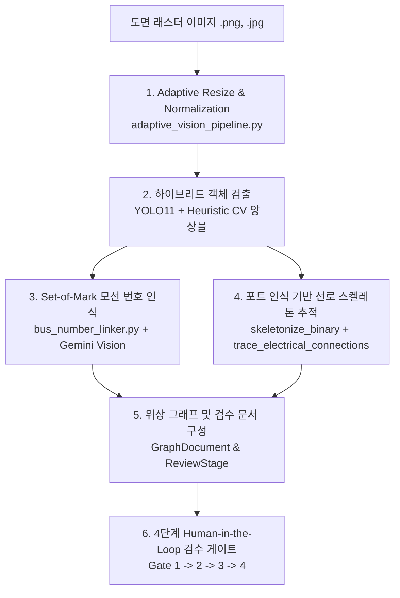

# 👁️ PowerLens AI Vision & Topology Extraction Pipeline

> **문서 버전**: v1.0.0 (2026-09-23)  
> **기준 코드베이스**: [`backend_api/core/vision_logic.py`](backend_api/core/vision_logic.py), [`backend_api/core/adaptive_vision_pipeline.py`](backend_api/core/adaptive_vision_pipeline.py), [`backend_api/core/cv_bus_detector.py`](backend_api/core/cv_bus_detector.py), [`backend_api/core/cv_load_detector.py`](backend_api/core/cv_load_detector.py), [`backend_api/core/cv_transformer_detector.py`](backend_api/core/cv_transformer_detector.py), [`backend_api/core/bus_number_linker.py`](backend_api/core/bus_number_linker.py)

---

## 1. 파이프라인 개요 (Pipeline Overview)

PowerLens의 컴퓨터 비전 파이프라인은 래스터 전력 계통 단선도(Single-Line Diagram, SLD) 이미지로부터 **심볼 객체 인식**, **포트 기반 선로 추적**, **모선 번호 OCR 판독**, 그리고 **전기적 위상 그래프(GraphDocument)** 형성을 원스톱으로 수행하는 하이브리드 비전 엔지니어링 시스템입니다.

---

## 2. 하이브리드 객체 검출 아키텍처 (Hybrid Object Detection)

단선도 도면은 굵은 실선의 모선 바, 원형 발전기, 삼각형/화살표 부하, 맞물린 원형 변압기 등 기하학적 규칙성이 강한 기호와 자유 형상의 텍스트가 공존합니다. PowerLens는 단일 딥러닝 검출기의 과적합 및 미탐을 방지하기 위해 **YOLO11 파인튜닝 모델**과 **전기 도면 특화 OpenCV 기하 검출기**를 융합한 하이브리드 검출 정책을 채택했습니다.

### 1) YOLO11 모델 및 클래스별 임계치 정책
- **기본 가중치**: `backend_api/models/2026_07_30_coslr.pt` (코사인 어닐링 스케줄러 학습)
- **클래스별 신뢰도 임계치 (`YOLO_CLASS_CONFIDENCES`)**:
  - `bus`: `0.30` (모선 바)
  - `generator`: `0.30` (발전기 심볼)
  - `load`: `0.27` (부하 심볼)
  - `transformer`: `0.50` (변압기 심볼)
  - `YOLO_IMAGE_SIZE`: `640`
  - `YOLO_PROBE_CONFIDENCE`: `0.05`

### 2) 기하학적 특화 CV 검출기
- **모선 검출 (`cv_bus_detector.py`)**:
  - 두꺼운 직선, 종횡 직사각형 윤곽선 추출 및 터미널 영역 계산.
  - `RELAXED_BUS_RESCUE`: 낮은 신뢰도의 YOLO 제안도 CV 직사각형 후보와 겹칠 경우 모선으로 복원.
- **부하 검출 (`cv_load_detector.py`)**:
  - 화살표, 삼각형, 지그재그 패턴 분석.
  - `YOLO_LOAD_PORT_RESCUE`: 부하의 꼬리(Tail) 부분이 도체 선로 그래프에 연결되어 있을 때 유효 부하로 복원.
- **변압기 검출 (`cv_transformer_detector.py`)**:
  - 2개 맞물린 원형(Two-circle) 및 코일 기하 패턴 분석.

### 3) 앙상블 및 NMS (Non-Maximum Suppression)
- YOLO 제안 박스와 CV 기하 후보를 IoU $0.35$ 기준으로 병합하여 중복 탐지를 배제하고, 두 검출기가 상호 보완하도록 구성.

---

## 3. 포트 인식 기반 선로 골격 추적 (Port-Aware Line Tracing)

기호 인식 후의 선로 연결은 그래픽적 단순 직선 매칭이 아닌, 실제 픽셀 도체 경로를 추적하여 추출됩니다.

1. **심볼 마스킹 (Symbol Masking)**:
   - 검출된 모선, 발전기, 부하, 변압기 영역을 도면 마스크에서 제외하여 기호 내부 선분이 선로로 오인되는 것을 방지.
2. **이진화 및 1픽셀 간극 보정 (`bridge_one_pixel_gaps`)**:
   - 도면 스캔 노이즈로 끊어진 선로의 1픽셀 미세 단선을 전기적으로 연결.
3. **골격화 (`skeletonize_binary`)**:
   - Zhang-Suen 계열 씬닝(Thinning) 알고리즘을 통해 굵은 선로를 1픽셀 너비의 중심선(Skeleton)으로 축소.
4. **8-연결 픽셀 경로 추적 (`trace_electrical_connections`)**:
   - 분기점(Branch points)과 끝점(End points)을 탐색하고, 교차선로 및 굴절 경로를 분석.
   - 인접 설비 포트에 스냅핑하여 최종 양단 단자(`from_element`, `to_element`) 연결 관계를 확정.
5. **선로 유형 분류**:
   - **일반 송전선로 (Transmission Branch)**: 모선-모선 간 직접 연결선. 조류계산 $Y_{\text{bus}}$에 포함.
   - **변압기 리드선 (`is_transformer_lead: True`)**: 모선과 변압기 심볼 간 물리 연결선. 저항 및 리액턴스 $0.0$, 조류계산 시 바이패스.
   - **설비 인입선 (`isEquipmentLead: True`)**: 발전기/부하와 모선 간 물리 연결선. 조류계산 시 바이패스.

---

## 4. Set-of-Mark 모선 번호 시각적 판독 (Bus Number OCR)

도면 내 인쇄된 모선 번호(Bus Number)는 폰트와 크기가 다양하고 선로와 겹쳐 있는 경우가 많아 전통적 OCR로는 오인식이 발생하기 쉽습니다. PowerLens는 **Set-of-Mark(SoM)** 프롬프팅 방식을 적용했습니다.

1. **국소 영역 크롭 및 태깅 (`bus_number_linker.py`)**:
   - 검출된 각 모선 바운딩 박스 주변 영역을 크롭.
   - 각 크롭에 시각적 마커 태그(`B1`, `B2`, `B3`...)를 오버레이한 콜라주 그리드 이미지 생성.
2. **Gemini Vision 모델 판독**:
   - `gemini-3.5-flash` (실패 시 `gemini-3.5-flash-lite` 폴백)에 콜라주 이미지를 전송하여 태그별 모선 번호 매핑 질의.
3. **엄격한 후처리 검증**:
   - 중복 번호, 숫자 형식 오류, 미인식 모선을 검증하여 확실한 번호만 `VERIFIED`로 부여.
   - 불확실한 번호는 임의 추측하지 않고 `UNCERTAIN` 상태로 유지하여 엔지니어 검수로 위임.
4. **연결 기기 번호 자동 전파 (`propagate_bus_numbers_to_devices`)**:
   - 확정된 모선 번호를 인접 연결된 발전기, 부하, 변압기 리드선으로 일관되게 전파.

---

## 5. 정량적 객체 검출 성능 평가 (Quantitative Evaluation)

26장의 독립 홀드아웃(Held-out) 단선도 정답 데이터셋을 대상으로 수행한 객체 단위 검출 성능입니다.

| 평가 항목 | 수치 | 비고 |
| :--- | :---: | :--- |
| **평가 기준 (IoU Threshold)** | $\ge 0.40$ | 정답 바운딩 박스와의 중첩도 |
| **정밀도 (Precision)** | **98.07%** | $764 / (764 + 15)$ |
| **재현율 (Recall)** | **97.95%** | $764 / (764 + 16)$ |
| **F1-Score** | **98.01%** | 정밀도와 재현율의 조화 평균 |
| **True Positive (TP)** | 764건 | 정상 인식된 전기 설비 심볼 |
| **False Positive (FP)** | 15건 | 도면 노이즈/텍스트 오탐지 |
| **False Negative (FN)** | 16건 | 미탐지된 설비 심볼 |

> [!IMPORTANT]
> **성능 지표의 해석 범위 한정 (Scope Disclaimer)**:  
> 본 **98.01% F1** 지표는 **단선도 내 설비 심볼(Bus, Gen, Load, Tr)의 "객체 검출(Object Detection)" 단계**에 국한된 지표입니다.  
> 도면 전체의 전기적 토폴로지 연결과 파라미터 매핑이 98.01% 자동으로 완성된다는 의미가 아니며, 전체 계통 해석 데이터의 무결성은 뒤이어 수행되는 **포트 인식 선로 추적**, **에이전트 검수 도구**, **4단계 인간 검수 게이트(Human Review Gate)**, 그리고 **엑셀 교차 대조**를 통해 단계별로 확정됩니다.

---

## 6. 에이전트 도구 및 검수 게이트 연동 (Agent & Review Integration)

비전 파이프라인에서 생성된 `GraphDocument`는 [`ReviewAgentSupervisor`](AGENTIC_WORKFLOW.md)와 긴밀하게 연동됩니다.

- **`port_aware_retry` 도구**: 결선 결함이나 미연결 포트 발생 시 해당 영역 주변에서 픽셀 선로 추적을 재실행하여 유효 연결 복원.
- **`roi_reanalysis` 도구**: 객체 누락이나 고립 모선 감지 시 국소 ROI에서 비전 파이프라인을 재호출하여 대체 검출 후보 도출.
- **Human Review Gate (Gate 1~4)**:
  - *Gate 1 (객체 검수)*: 검출된 객체의 바운딩 박스와 클래스 확인/수정.
  - *Gate 2 (모선 매핑)*: OCR 판독된 모선 번호 확인/수정.
  - *Gate 3 (선로 결선)*: 추적된 선로 및 모호 결선 수동 교정.
  - *Gate 4 (최종 엑셀)*: 계통 엑셀 파일과의 불일치 확인 및 수리 제안(Apply/Reject).
