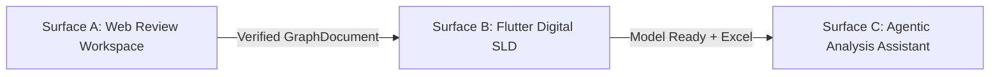
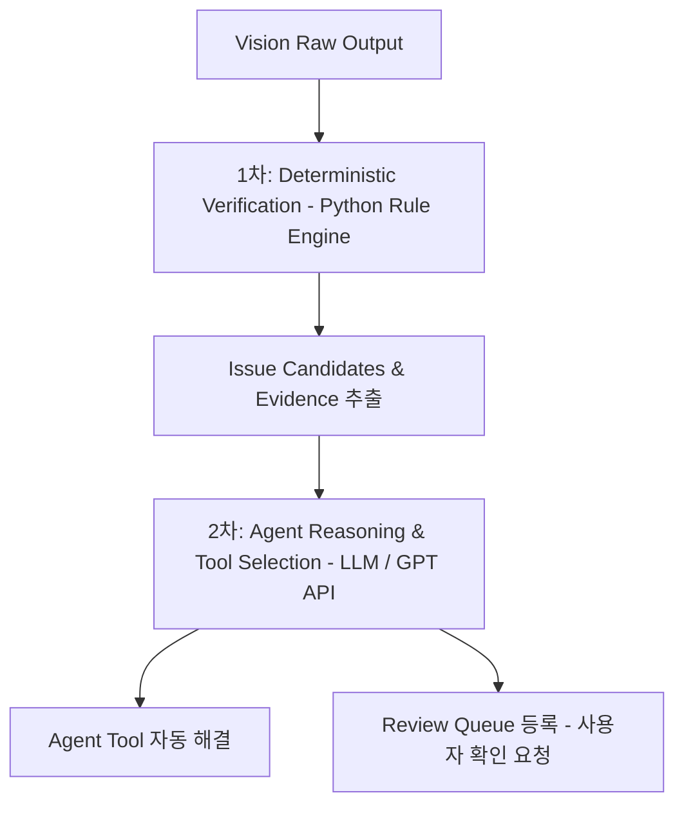
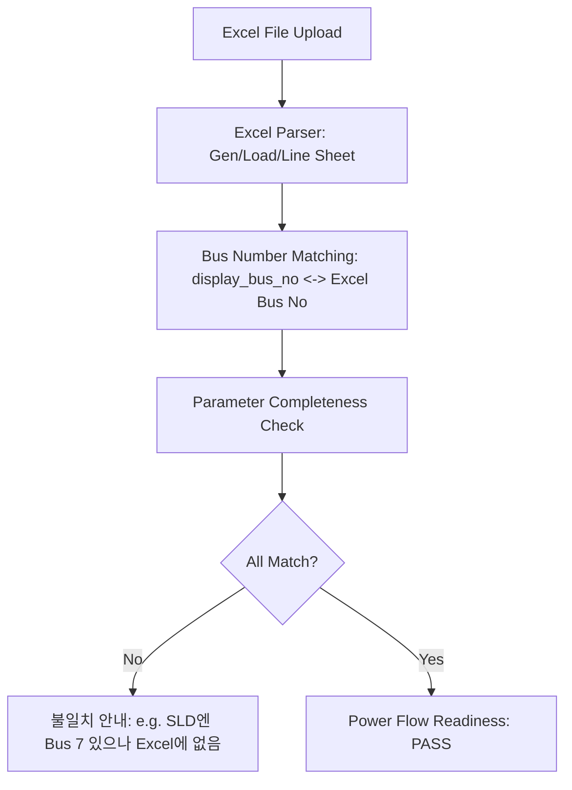

# ⚡ VisionFlow Agent

## Agentic AI 기반 전력계통 단선도 검증·디지털화·편집 및 자연어 전력계통 해석 플랫폼

- **PRD Version:** Competition Final
- **개발 기간:** 2주
- **개발 인원:** 2명
- **기존 시스템:** VisionFlow
- **핵심 원칙:** 기존 Vision / Topology / Flutter / pandapower는 최대한 재사용하고 검증·Agent Layer만 추가
- **주요 사용자 환경:**
  1. **Web Review Workspace** (검수 및 토폴로지 검증)
  2. **Flutter Digital SLD App** (디지털 단선도 편집 및 운영)
  3. **Agentic Power-System Assistant** (자연어 기반 계통 해석)

---

# 1. 최종 제품 정의

VisionFlow Agent는 전력계통 단선도 이미지·사진을 AI로 인식한 후 곧바로 편집 화면으로 넘기지 않는다.

먼저 **원본 회로도와 AI가 인식한 심볼·선로·결선 결과를 Web Review Workspace에서 대조**한다.

Agent는 다음 정보를 이용하여 인식 결과를 다시 검증한다:
- Vision confidence
- 심볼 형상
- Port 위치
- 선로 연속성
- Bus 구조
- 결선 관계
- 전기적 연결 타당성
- 주변 설비와의 Topology

### 의심 영역에 대한 Agent 상호작용
의심되는 부분은 Agent가 직접 사용자에게 알린다.
> *예:*  
> "Generator G3의 아래쪽 연결선이 명확하지 않습니다."  
> "현재 B5와 B6 두 연결 후보가 있습니다."  
> "원본 이미지를 다시 확인해주세요."

### 사용자 피드백 반영
Agent가 놓친 부분을 사용자가 발견하고 지적할 수 있다.
> *예:*  
> "여기 Load 하나 빠졌어."  
> "이 선은 연결된 게 아니야."  
> "저건 Transformer야."

Agent는 해당 위치를 다시 분석하고 수정 후보를 생성한다.

모든 심볼과 결선을 AI와 사람이 함께 확인한 뒤 사용자가 **“회로도 검증 완료”**를 승인한다. 그 이후에만 회로도는 `Verified Digital SLD` 상태가 되고 Flutter 편집 Canvas로 전달된다.

Flutter에서는 사용자가 각 Bus의 번호/이름을 직접 지정한다.  
이후 Excel 전력계통 데이터를 업로드하면 Agent가 Digital SLD와 Excel 데이터를 매핑하고 실제 `pandapower` 계산 Tool을 이용하여:
- 조류계산
- Bus 전압
- 선로 유효전력 (P)
- 선로 무효전력 (Q)
- 선로 Loading (%)
- 선로 전류 (Current)
- 전력 흐름 방향
- 계통 손실 (Loss)

등을 자연어 요청으로 조회할 수 있도록 한다.

---

# 2. 프로젝트의 핵심 명분

본 프로젝트의 목적은 단순한 회로도 객체 검출이 아니다.

> **핵심 목적:**  
> **이미지 형태로 존재하는 전력계통 정보를 신뢰할 수 있고 수정 가능하며 실제 전력계통 계산에 사용할 수 있는 Digital Power-System Model로 전환하는 것**

### 전체 파이프라인 흐름
```text
실제 회로도 이미지
        ↓
Vision AI (YOLO + CV Topology)
        ↓
Draft Recognition (GraphDocument)
        ↓
Web Review Workspace
        ↓
Agent Verification (Deterministic Rule + LLM Reasoning)
        ↓
자동 재분석 (ROI Retry) + 사용자 검수 (Human-in-the-Loop)
        ↓
결선 최종 인증
        ↓
Verified Digital SLD
        ↓
Flutter Canvas (디지털 모델 운영)
        ↓
Bus 번호 / 이름 지정
        ↓
Excel Data Upload
        ↓
Agent Data Mapping (Bus Number Matching)
        ↓
Power-System Analysis Tools (pandapower)
        ↓
조류 / 전압 / P-Q / 전류 / Loading / Loss 자연어 질의응답
```

---

# 3. 기존 시스템에서 유지할 것

현재 구현된 핵심 기술은 새로 만들지 않고 재사용한다.

## 3.1 Vision
- YOLO 기반 심볼 검출 (Bus / Generator / Load / Transformer)
- Canonical inference & Secondary inference
- Tiled inference
- Text/numeral filtering
- Bus merge / split / snap
- Line topology & Port-aware topology
*(활성 Vision 파이프라인은 이미 YOLO, canonical processing, secondary inference, bus 처리, component topology, port-aware topology를 수행함)*

## 3.2 Power System
- `build_net_from_elements()`
- `run_power_flow_simulation()`
- pandapower bus / generator / load / line / transformer 생성
- Bus 결과, Line 결과, 계통 손실, 최소/최대 전압, 최대 선로 loading 계산

## 3.3 Flutter
- `PowerCanvasPage`
- `DrawingElement`
- Component 추가 / 이동 / Line 연결
- Property dialog & Undo/Redo
- AI 이미지 분석 호출 인터페이스

---

# 4. 가장 중요한 Architecture 변경

### 기존 구조
```text
Image ──> Vision ──> Flutter Canvas
```

### 신규 구조 (검수 Gate 도입)
```text
Image
  ↓
Vision
  ↓
Draft GraphDocument
  ↓
Web Review
  ↓
Agent Verification
  ↓
Human Verification
  ↓
Verified GraphDocument
  ↓
Flutter Canvas
```
> **핵심:** Flutter Canvas로 넘어가기 전에 철저한 검수 Gate를 추가하여 완전무결한 모델만 Canvas로 전송한다.

---

# 5. 3개의 제품 화면 (Surface)

VisionFlow Agent는 세 단계의 사용자 Surface를 가진다.



1. **Surface A — Web Review Workspace**
   - 목적: 원본 회로도와 AI 인식 결과를 비교하여 정확한 Digital SLD를 확정하는 공간 (실제 계통 편집 전 단계)
2. **Surface B — Flutter Digital SLD**
   - 목적: 검증된 회로도를 실제 편집 가능한 전력계통 모델로 사용 (Bus 번호/이름, 설비 파라미터 관리)
3. **Surface C — Agentic Analysis Assistant**
   - 목적: 자연어로 전력계통 계산과 데이터 조회를 실시간 수행

---

# 6. Surface A — Web Review Workspace 상세

Web Review가 이번 대회의 핵심 Agentic AI 화면이다.

### Layout 구조
```text
┌─────────────────────────────────────────────────────────────┐
│ VisionFlow AI Review Workspace                              │
├─────────────────────┬─────────────────────┬─────────────────┤
│                     │                     │                 │
│ Original SLD        │ AI Recognition      │ Review Queue    │
│ (원본 단선도 이미지)  │ Overlay             │ (이슈 목록)      │
│                     │ (심볼/선로/포트 중첩) │ Agent Activity  │
│                     │                     │ (진단/재분석)   │
├─────────────────────┴─────────────────────┴─────────────────┤
│ Ask Agent                                                   │
│ [ 사용자 질의 및 수정 지시 입력창 _______________________ ] [전송] │
├─────────────────────────────────────────────────────────────┤
│ [ 🚀 검증 완료 및 Digital SLD 생성 ]                         │
└─────────────────────────────────────────────────────────────┘
```

---

# 7. 원본 이미지 대조 & Overlay

- **왼쪽**: 사용자가 업로드한 원본 단선도 이미지
- **가운데**: 동일한 이미지 위에 AI 인식 결과를 시각적으로 Overlay
  ```text
  Bus          → Box / Line Segment
  Generator    → Bounding Box + Port Point
  Load         → Bounding Box + Port Point
  Transformer  → Bounding Box + Dual Port Points
  Line         → Skeleton / Vector Path
  Port         → Connection Point
  Connection   → Graph Edge
  ```

---

# 8. Box 및 Topology 정확도 시각 확인

사용자가 UI에서 즉시 확인 가능한 항목:
- 심볼 Box 위치 및 크기가 맞는가?
- 심볼 클래스(Bus, Gen, Load, Tr)가 올바른가?
- 누락된 심볼 또는 오검출(False Positive)이 있는가?
- Bus 길이가 정확하며 분할/병합이 필요한가?
- 선로가 끊김 없이 제대로 추적되었는가?
- 결선(Port-to-Bus/Line)이 올바른가?

---

# 9. 2단계 Agent Verification 메커니즘

Agent는 Vision 결과를 맹신하지 않고 2단계 검증을 수행한다.



- **1차 — Deterministic Verification (Python)**: 기하학적·전기적 규칙 기반 빠른 오류 필터링
- **2차 — Agent Reasoning / Tool Selection (GPT API)**: 컨텍스트 및 ROI 기반 지능형 추론과 툴 실행

---

# 10. Deterministic Verification 검사항목

- `disconnected Generator`: 연결 버스가 없는 발전기
- `disconnected Load`: 연결 버스가 없는 부하
- `missing Transformer Port`: 2차측 또는 1차측 연결 누락 변압기
- `dangling line`: 한쪽 끝이 어디에도 연결되지 않은 미아 선로
- `Bus fragmentation`: 동일 선상에서 끊어진 버스 조각
- `duplicate component`: 중복 검출된 설비
- `low-confidence component`: 확신도가 임계치 미만인 객체
- `abnormal geometry`: 비정상적인 종횡비 또는 크기
- `multiple connection candidates`: 다중 연결 모호성이 존재하는 컴포넌트

---

# 11. 전기적 특징 기반 증거(Evidence) 구조

Agent에게 단순 Confidence뿐만 아니라 형상, 포트, 토폴로지 구조를 종합 전달한다.

```yaml
Component: Generator G3
Vision:
  confidence: 0.94
Shape:
  generator_circle_pattern: PASS
Port:
  bottom_port_detected: true
Topology:
  connected_bus_count: 0
Wire:
  candidate_paths: 2
Candidates:
  - B5
  - B6
Status: "Additional Analysis Required"
```

---

# 12. Agent 사용 가능 도구 (Agent Tools)

기존 Vision/CV 파이프라인 코드를 Adapter 형태로 래핑하여 Agent Tool로 노출:

- `secondary_inference()`: 2차 정밀 추론 실행
- `high_resolution_inference()`: 고해상도 타일링 추론
- `roi_reanalysis(bbox)`: 특정 관심 영역(ROI) 국소 재분석
- `port_aware_retry(node_id)`: 포트 중심 결선 스켈레톤 재추적
- `merge_fragmented_bus(bus_ids)`: 분절된 버스 병합
- `validate_topology(graph_doc)`: 전체 토폴로지 유효성 검사

---

# 13. Agent 자율 재분석 루프 (Autonomous Retry)

```text
Generator G3 결선 불확실
        ↓
Agent 판단 (Tool 호출)
        ↓
port_aware_retry() 실행
        ↓
여전히 불확실할 경우
        ↓
roi_reanalysis() 실행
        ↓
MAX_ATTEMPTS(2~3회) 초과 시
        ↓
Human Review Queue로 이관
```
> **가드레일:** 무한 루프 방지를 위해 자동 Retry는 `MAX_ATTEMPTS = 2~3`으로 엄격히 제한한다.

---

# 14. Review Queue UI

발견된 이슈와 해결 현황을 직관적으로 표시:

```text
┌──────────────────────────────────────────────┐
│ 📋 AI REVIEW STATUS                          │
├──────────────────────────────────────────────┤
│ 전체 심볼:          26 개                     │
│ 확정(Verified):     21 개                     │
│ Agent 자동 해결:     2 개                     │
│ 사용자 확인 필요:    3 개                     │
└──────────────────────────────────────────────┘
```

---

# 15. Review Issue 인터랙션 카드

```text
┌──────────────────────────────────────────────┐
│ ⚠️ ISSUE 02: Generator G3 Connection         │
├──────────────────────────────────────────────┤
│ [ 원본 ROI Crop 이미지 미리보기 ]             │
│                                              │
│ 🤖 AI 판단:                                  │
│ "Generator 자체는 높은 확률(94%)로 맞습니다. │
│  하지만 아래쪽 lead line 결선이 모호합니다." │
│                                              │
│ 연결 후보:                                   │
│ [ 1️⃣ B5에 연결 ]   [ 2️⃣ B6에 연결 ]          │
│ [ ✏️ 직접 지정 ]                             │
└──────────────────────────────────────────────┘
```

---

# 16. 사용자 주도 피드백 및 지적 (Human-in-the-Loop)

사용자가 Agent에게 누락/오류를 능동적으로 지시할 수 있다.

```text
사용자: "여기 Load 하나 빠졌어." (마우스 클릭 또는 ROI 지정)
        ↓
Agent: 지정 영역 ROI Crop 생성
        ↓
Vision 국소 재분석 (roi_reanalysis)
        ↓
기존 GraphDocument와 비교
        ↓
Load 후보 및 인근 버스 결선 경로 탐색
        ↓
수정 Preview 시각화 및 사용자 승인 요청
```

---

# 17. 사용 가능한 자연어 수정 명령 (MVP)

- "여기 심볼 하나 빠졌어."
- "이건 Generator야." / "이건 Load야." / "이건 Transformer야."
- "이 선은 연결된 거야." / "이 선은 연결된 게 아니야."
- "이 Bus가 너무 짧게 잡혔어."
- "저 박스는 잘못 잡힌 거야 (삭제해줘)."

---

# 18. Agent의 양방향 재검증

사용자의 수정 요청이라도 물리적/전기적 법칙에 맞는지 Agent가 재검증한다.

> **상황 A (일치):**  
> 사용자: "G3는 B6에 연결돼."  
> Agent: "원본 이미지와 Port 구조상 B6 연결과 일치합니다. 적용합니다."

> **상황 B (불일치 의심):**  
> 사용자: "G3는 B6에 연결돼."  
> Agent: "현재 검출된 선로는 B5 방향으로 이어지는 것으로 보입니다. B6 연결이 확실한지 다시 확인해주세요."

---

# 19. Human-in-the-Loop의 가치

```text
AI Evidence (Vision Data)
        +
Electrical Rules (Domain Knowledge)
        +
Human Knowledge (User Intent)
        ↓
Final Verification (무결점 디지털 모델)
```

---

# 20. 검증 완료 조건 및 게이트

Web Review 화면에서 아래 조건이 모두 충족되어야 완료 버튼이 활성화된다:
- `Critical Issues == 0`
- `Unresolved Connections == 0`
- `All Components Verified (PASS)`
- `Topology Verified (PASS)`

사용자가 **`[ 🚀 회로도 검증 완료 ]`** 클릭 시 `status = VERIFIED`로 전환.

---

# 21. GraphDocument 신규 표준 스키마

Flutter의 `List<DrawingElement>`와 Backend 간의 신뢰 가능한 Single Source of Truth 데이터 모델을 정의한다.

```yaml
GraphDocument:
  document_id: str
  revision: int
  status: "DRAFT" | "IN_REVIEW" | "VERIFIED"
  image_metadata:
    filename: str
    width: int
    height: int
    original_resolution: [int, int]
  nodes: list[Node]
  edges: list[Edge]
  ports: list[Port]
  verification:
    is_verified: bool
    verified_by: "HUMAN" | "AGENT_AUTO"
    issue_count: int
    unresolved_issues: list[str]
```

---

# 22. Node 스키마 및 Stable Internal ID

```yaml
Node:
  internal_id: str          # e.g., "node_7fa2" (고유 불변 ID)
  type: "bus" | "generator" | "load" | "transformer"
  bbox: [float, float, float, float]  # [ymin, xmin, ymax, xmax]
  original_bbox: [float, float, float, float]
  center: [float, float]
  confidence: float
  source: "YOLO" | "CV_RECOVERY" | "USER_MANUAL"
  ports: list[str]          # port_ids
  display_name: str | null  # e.g., "Seoul_154kV"
  display_bus_no: int | null # e.g., 7 (Review 단계에서는 null 가능)
  parameters: dict          # P, Q, V, R, X 등 전기 파라미터
```

> **규칙:** `internal_id`와 `display_bus_no`를 분리하여 Bus 번호가 변경되거나 없더라도 내부 토폴로지 연결이 깨지지 않도록 보장한다.

---

# 23. Flutter Canvas 연동 (Surface B)

`status == VERIFIED`인 `GraphDocument`만 Flutter Canvas로 전달된다.

```text
Verified GraphDocument
        ↓
GraphDocument Adapter
        ↓
DrawingElement List
        ↓
Flutter PowerCanvasPage 로드
```

### Bus 번호 지정 인터페이스
- Canvas 상의 모든 Bus 옆에 번호 배지 표시:
  - 번호 미지정: `Bus [ ? ]`
  - 번호 지정 완료: `B1`, `B2`, `B7`
- 사용자가 Bus 선택 후 `Bus Number` 다이얼로그에서 번호 입력 및 저장
- OCR 추정치는 보조 추천(Candidate)으로만 표시하며 확정은 사용자 입력 기준

### 파라미터 편집
- 기존 Property Dialog 활용: Bus(V, Slack), Gen(P, V), Load(P, Q), Line(R, X), Tr 파라미터 편집 가능

---

# 24. Excel 데이터 업로드 및 Agent Mapping

사용자가 계통 제원 Excel 파일을 업로드하면 Agent가 Digital SLD와 매핑한다.



### Power Flow Readiness 검사항목
- `SLD VERIFIED`: PASS
- `Bus numbering complete`: PASS
- `Excel mapping complete`: PASS
- `Slack Bus 지정 여부`: PASS (1개 이상)
- `Generator / Load data completeness`: PASS
- `Line R/X parameters valid`: PASS

---

# 25. Surface C — Agentic Analysis Assistant 상세

자연어 명령을 해석하여 검증된 파이썬 Tool(`pandapower`)을 호출하고 결과를 자연어로 응답한다.

### 주요 질의응답 시나리오
1. **조류계산 실행**:
   - 사용자: *"조류계산 해줘."*
   - Agent: `run_power_flow_simulation()` 실행 후 수렴 여부 및 총 손실/최대 로딩 요약 보고
2. **특정 버스 전압 조회**:
   - 사용자: *"Bus 7 전압 얼마야?"*
   - Agent: `res_bus.loc[7, 'vm_pu']`, `va_degree` 값 반환 (*"Bus 7 전압은 1.024 p.u. (위상각 -4.2°)입니다."*)
3. **선로 조류 (P/Q) 및 흐름 방향**:
   - 사용자: *"Bus 3에서 Bus 7 방향으로 흐르는 전력 알려줘."*
   - Agent: 해당 선로의 `p_from_mw`, `q_from_mvar` 조회 후 방향과 함께 반환
4. **최대 부하 선로 (Max Loading)**:
   - 사용자: *"가장 많이 부하된 선로 알려줘."*
   - Agent: `res_line['loading_percent'].max()` 선로 번호 및 % 반환
5. **선로 전류 (Current)**:
   - 사용자: *"이 선로의 전류 알려줘."*
   - Agent: `res_line['i_ka']` 조회 후 kA 단위 전류값 반환
6. **계통 손실 (Loss)**:
   - 사용자: *"전체 손실 얼마야?"*
   - Agent: `total_losses_mw` 반환
7. **파라미터 변경 후 재계산 (What-If 분석)**:
   - 사용자: *"G2 전압을 1.03 pu로 바꾸고 다시 계산해줘."*
   - Agent: 파라미터 업데이트 -> 조류계산 재실행 -> 변경 전/후 전압 및 조류 변화 비교 보고

---

# 26. Agent 원칙 및 제약사항

### Agent의 역할: Orchestrator
- 사용자 의도 파악
- 적절한 Deterministic Tool 선택 및 실행
- 계산 결과 해석 및 사용자 친화적 설명

### ❌ Agent가 절대 임의로 생성(Hallucination)하지 않는 것
- Bounding Box 좌표
- Bus / Port 위치
- Topology 결선
- P, Q, Voltage, Current, Loading, Loss 수치
> **원칙:** 모든 수치와 토폴로지는 검증된 Deterministic 알고리즘과 pandapower 엔진에서만 산출한다.

---

# 27. 구현 전략 및 아키텍처

- **단일 Flutter 코드베이스 활용**: 새로운 React 웹 프레임워크를 만들지 않고, Flutter Web Route (`/review`, `/canvas`)로 Surface A와 B를 통합 구축하여 개발 속도 극대화
- **Backend 모듈 구조**:
  ```text
  backend_api/
    ├── review/
    │   ├── graph_document.py      # GraphDocument 표준 스키마
    │   ├── issue_schema.py        # Review Issue 모델
    │   ├── verification.py        # 1차 Deterministic 규칙 엔진
    │   └── roi_service.py         # ROI Crop 및 이미지 서비스
    ├── agent/
    │   ├── supervisor.py          # VisionFlow Supervisor Agent
    │   ├── schemas.py             # Agent 입출력 스키마
    │   ├── state.py               # 세션 및 상태 관리
    │   └── tool_registry.py       # LLM Tool 정의 및 디스패처
    └── agent_tools/
        ├── vision_tools.py        # ROI Retry, Port Retry 어댑터
        ├── edit_tools.py          # 토폴로지 수정 어댑터
        ├── excel_tools.py         # Excel 매핑 및 검증기
        └── powerflow_tools.py     # pandapower 쿼리 어댑터
  ```

---

# 28. 역할 분담 (2인 개발)

### Developer A (Backend / Vision Verification / Agent / Power System)
- `/analyze_image` 인터페이스 및 모델 경로 수정
- `GraphDocument` 스키마 및 변환 어댑터 구현
- Verification Engine (1차 룰 검증) 및 Issue 생성
- Agent Tools (Vision Retry, ROI Crop, Topology Edit)
- Excel Parser & Bus Mapping Validator
- pandapower Query Tools (Voltage, P/Q, Loading, Current, Loss)
- GPT Tool Calling & Supervisor Agent 파이프라인

### Developer B (Review UX / Flutter / Digital SLD)
- Web Review 화면 UI (원본 이미지 뷰어 + AI Overlay + BBox/Line 렌더링)
- Review Queue & Issue 인터랙션 카드 UI
- Agent Activity 로그 및 채팅 UI
- 사용자 피드백(후보 선택, 심볼/선로 직접 수정) 인터랙션
- `GraphDocument` -> `DrawingElement` Canvas Import
- Bus 번호 지정 배지 및 입력 UI
- Excel 업로드 및 계통 해석 결과 시각화 / 자연어 질의응답 UI

---

# 29. 14일 개발 로드맵 (2주 스프린트)

| Day | Developer A (Backend/Agent) | Developer B (Frontend/UX) | Gate / 마일스톤 |
|:---|:---|:---|:---|
| **Day 1** | 기존 상태 Freeze, `GraphDocument` 계약 확정 | Review UI 와이어프레임 & 화면 스켈레톤 | 데이터 계약 완료 |
| **Day 2** | `/analyze_image` 계약 수정, Stable ID 구현 | 원본 이미지 + AI Box/Line Overlay 렌더링 | **Gate: 원본 위에 정확한 좌표 Overlay** |
| **Day 3** | Vision → GraphDocument 변환기 완성 | Review Queue 레이아웃, 심볼 선택 & ROI 확대 | 데이터 뷰어 완성 |
| **Day 4** | 1차 Verification Engine (단선/단편화 버스 검출) | Issue 카드 UI 및 후보 선택 인터랙션 | 이슈 검출 파이프라인 |
| **Day 5** | Vision Retry Tools (ROI, Port 재추적) 안정화 | Agent Activity 로그 및 재분석 피드백 UI | **Gate: 의심영역 Retry 후 결과 갱신** |
| **Day 6** | Human Correction API (수정 연산자) | 사용자 수동 수정/삭제/추가 UI | 양방향 수정 체계 |
| **Day 7** | **[HARD GATE]** 전체 Review 파이프라인 통합 테스트 | **[HARD GATE]** Web Review E2E 검증 UI | **Gate: Image -> Review -> Verified 완료** |
| **Day 8** | Verified GraphDocument 전송 API | Flutter Canvas Import & Bus 번호(B?) UI | 디지털 SLD 전환 |
| **Day 9** | Excel Parser 개선 & Bus 번호 자동 매칭 | Excel 업로드 UI & 매핑 현황 대시보드 | 데이터 매핑 완료 |
| **Day 10** | Power Flow Readiness 검증기 & pandapower 연동 | 계통 결과 Canvas 시각화 오버레이 | 조류계산 연동 |
| **Day 11** | Power Query Tools (V, P/Q, Loading, Loss, I) | 자연어 질의 입력창 & 결과 표시 카드 | 쿼리 어댑터 완성 |
| **Day 12** | GPT Supervisor Agent (자연어 Tool Calling) | Agent 대화형 해석 Assistant UI | 자연어 계통 해석 |
| **Day 13** | 통합 E2E 테스트 (Review -> SLD -> Excel -> AI 질의) | 대표 데모 시나리오 점검 및 UI 폴리싱 | 데모 시나리오 확정 |
| **Day 14** | Feature Freeze, 최종 성능 검증 및 버그 수정 | 발표 자료, 데모 영상 및 백업 시나리오 준비 | **최종 릴리즈 (RC)** |

---

# 30. 범위 관리 (MVP vs 제외)

### ✅ MVP 필수 기능
1. **Review**: 원본 대조, AI Overlay(Box/Line), 이슈 검출, ROI 재분석, Human-in-the-loop 수정, 검증 완료 승인
2. **Digital SLD**: GraphDocument Canvas 로드, Bus 수동 번호 지정 및 라벨링, 기본 파라미터 편집
3. **Analysis**: Excel 업로드 및 매핑 검증, pandapower 조류계산, Bus 전압/Line 조류/선로부하/손실/전류 자연어 질의응답

### ⏸️ Stretch Goals (시간 여유 시)
- Bus 번호 OCR Candidate 자동 추천
- 누락 심볼 자동 복구 제안
- 선로 조류 애니메이션 화살표
- 모선 전압 히트맵

### ❌ 제외 대상 (2주 일정 엄수)
- PDF 다중 페이지 처리 / 모든 텍스트의 100% 완전 자동 OCR
- N-1 상정도 해석 / 최적조류계산 (OPF)
- Multi-Agent 프레임워크 / RAG / Vector DB
- 새로운 Frontend Framework (React 등) 도입

---

# 31. 최종 제품 한 문장 요약

> **VisionFlow Agent는 실제 전력계통 단선도를 AI와 사람이 함께 검증하여 신뢰 가능한 편집형 Digital SLD로 변환하고, Bus 번호와 Excel 데이터를 연결한 뒤 자연어 Agent를 통해 실제 조류계산·전압·전력·전류·선로부하 분석까지 수행할 수 있는 Agentic AI 기반 전력계통 디지털화·해석 플랫폼이다.**
