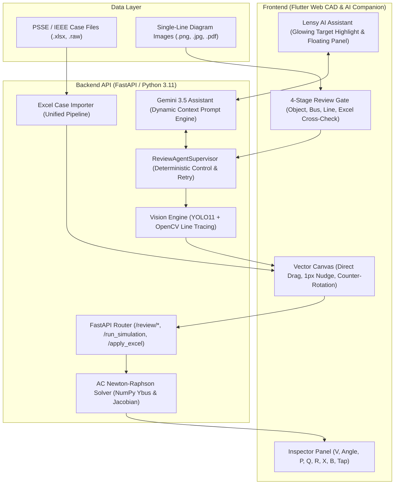

# ⚡ PowerLens Pro (전력계통 AI 단선도 인식 및 조류계산 플랫폼)

<div align="center">


**PowerLens = AI Vision + Human Review Gate + Agentic Review Workflow + Excel Cross-Check + deterministic AC Power Flow Solver**  
*AI 기반 전력 단선도(Single-Line Diagram) 자동 객체 인식, LLM 지능형 검수 안내, 웹 CAD 편집 및 고성능 AC Newton-Raphson 조류계산 원스톱 솔루션*

[프로젝트 개요](#-프로젝트-개요-executive-summary) • [핵심 기술 성과](#-핵심-엔지니어링-및-ai-기술-성과) • [에이전트 워크플로우](../AGENTIC_WORKFLOW.md) • [기술 검증 보고서](../EVALUATION.md) • [시스템 아키텍처](#-시스템-아키텍처-system-architecture) • [빠른 시작 가이드](#-빠른-시작-가이드-quick-start)

> 👥 **Team & Docs**: 에이전트 상세 구조는 [`../AGENTIC_WORKFLOW.md`](../AGENTIC_WORKFLOW.md), 정량/정성 평가 보고서는 [`../EVALUATION.md`](../EVALUATION.md), 전체 시스템 상세 설계는 [`docs/SYSTEM_ARCHITECTURE_AND_TECHNICAL_DOCS.md`](./SYSTEM_ARCHITECTURE_AND_TECHNICAL_DOCS.md), 팀 인수인계는 [`../TEAM_HANDOFF.md`](../TEAM_HANDOFF.md), 특허 출원 내용은 [`../PowerLens_특허명세서_공식출원용.md`](../PowerLens_특허명세서_공식출원용.md)를 참조하세요.

</div>

---

## 📌 프로젝트 개요 (Executive Summary)

전력 계통 해석(Power System Analysis) 분야에서 수십 모선 이상의 전력망 데이터를 구축하려면 단선도(Single-Line Diagram) 도면을 보고 수작업으로 모선 번호, 송전선로 임피던스, 발전기/부하 제원 등을 수치해석 툴에 일일이 타이핑해야 했습니다. 이 과정은 수 시간 이상의 노동을 필요로 하며 휴먼 에러로 인한 계통 해석 오류를 빈번하게 유발합니다.

**PowerLens Pro**는 이러한 문제를 해결하기 위해 개발된 **지능형 전력 엔지니어링 웹 CAD & 수치해석 솔루션**입니다.

1. **AI Vision & CV 파이프라인**: 래스터 도면 이미지에서 모선(Bus), 발전기(Gen), 부하(Load), 변압기(Tr), 선로(Line)를 자동 탐지하고 토폴로지를 추출합니다.
2. **4단계 AI-인간 협업 검수 체계**: 100% 자동화의 오류 가능성을 방어하기 위해 객체 검수 → 모선 매핑 → 선로 결선 → 엑셀 대조의 4단계 검증 게이트(Review Gate)를 제공합니다.
3. **결정론적 Supervisor & Gemini 지능형 어시스턴트**: 결정론적 상태 관리자(`ReviewAgentSupervisor`)가 도구 실행과 패치 프리뷰(`PatchPreview`)를 안전하게 통제하고, Gemini 3.5 기반 어시스턴트가 상황 인지형 조언 및 화면 내 25개 이상의 UI 버튼 네온 점등을 지원합니다.
4. **웹 기반 인터랙티브 CAD 캔버스**: 직관적인 마우스 드래그앤드롭, 방향키 미세 정렬(1px/10px Nudge), `Ctrl+R` 90도 회전 및 라벨 방향 자동 보정(Counter-Rotation) 기능을 지원합니다.
5. **자체 구현 Full AC Newton-Raphson 수치해석 엔진**: 3모선 및 IEEE 24-bus RTS 표준 계통에서 허용 오차 $10^{-4}$ 이하, 4회 반복 내 수렴 및 전력수지 무결성 검증을 통과했습니다.

---

## 🏆 핵심 엔지니어링 및 AI 기술 성과

### 1. 🤖 지능형 에이전트 & 자율 검수 체계 (Agentic Review & Lensy AI)
- **결정론적 감독자 & LLM 하이브리드 아키텍처**: 전체 워크플로우의 안전한 전이와 게이트 제어는 결정론적 `ReviewAgentSupervisor`가 담당하고, 자연어 의도 해석과 상황 진단은 Gemini 3.5 LLM이 분담.
- **도구 실행 및 안전한 패치 프리뷰 (`PatchPreview`)**: 선로 재추적(`port_aware_retry`), 영역 재분석(`roi_reanalysis`) 등의 특화 도구를 자율 실행하며, 변경 사항은 즉시 덮어쓰지 않고 diff 프리뷰를 생성하여 엔지니어의 최종 승인(Human Apply/Reject)을 거쳐 확정.
- **상황 인지형 프롬프트 주입**: 현재 작업 단계(Stage), 미승인 객체 수, 의심(Suspicious) 사유, 결선 상태, 누락 후보군을 구조화하여 프롬프트로 전달.
- **✨ 실시간 UI 네온 하이라이트 (Glowing Target System)**:
  - 질문 의도 및 상태에 맞춰 사용자가 조작해야 할 화면 요소를 반짝이는 네온 애니메이션으로 표시 (`GlowingTargetWrapper`).
  - [정상 객체 일괄 승인], [객체 검수 완료], [미확정 결선], [누락 후보], [시뮬레이션 실행] 등 25개 이상의 타깃 컴포넌트 완벽 지원.
- **드래그 가능 플로팅 UI 패널 (`PowerLensAIPanel`)**: 캔버스 작업 영역을 가리지 않고 자유롭게 이동 가능하며 실시간 추천 액션 칩 제공.

### 2. 🛡️ 4단계 AI-인간 협업 도면 검수 파이프라인 (Staged Review Gate)
- **Phase 1 [① 객체 검수 (Object Review)]**:
  - YOLO11 + CV 하이브리드 검출. 2단계 신뢰도 임계치 적용:
    - *1차 최소 검출 기준*: 클래스별 0.27 ~ 0.50 이상 (도면 노이즈 필터링).
    - *2차 검수 게이트 기준*: 모선 0.60, 발전기 0.55, 부하 0.50, 변압기 0.50 이상 시 정상 객체(`DETECTED`)로 자동 분류.
  - 신뢰도 미달, 객체 중첩(IoU > 0.35), 종횡비 결함 시 의심 객체(`SUSPICIOUS`)로 분류하여 1:1 수동 검수 유도.
  - 정상 객체는 **[정상 객체 승인]** 버튼으로 1클릭 일괄 승인 가능.
- **Phase 2 [② 모선 번호 매핑 (Bus Mapping Review)]**:
  - 도면 텍스트 OCR 및 기하학적 공간 근접도(Spatial Distance)를 결합하여 각 모선에 고유 번호(Bus Number) 1:1 부여 및 인접 발전기/부하 자동 전파.
- **Phase 3 [③ 선로 결선 검수 (Connection Review)]**:
  - 픽셀 스켈레톤화 및 선로 추적(Line Tracing)으로 송전선로(Branch), 변압기, 인입선 결선 검수. 모호 결선(Ambiguous) 수동 교정 및 단선/고립 모선 토폴로지 검증.
- **Phase 4 [④ 최종 확인 & 엑셀 대조 (Verified Final & Excel Cross-Check)]**:
  - 무결점 `VerifiedSLD` 확정 요약 확인, 전력계통 엑셀 파일(.xlsx)과 도면 설비 제원(Bus/Branch/Gen/Load) 자동 교차 대조 및 불일치 AI 진단 모달 제공 후 캔버스 전송.

### 3. 🧠 AI Vision 기반 단선도 토폴로지 자동 복원
- **YOLO11 + OpenCV 하이브리드 객체 인식**: 모선·부하·변압기는 형태와 전기적 연결 조건을 우선 검사하고, YOLO11은 발전기 탐지와 CV 후보 보완에 활용.
- **객체 검출 성능 검증**: 26장 별도 홀드아웃 정답셋에서 YOLO11 파인튜닝 모델과 CV 보정 파이프라인이 IoU 0.40 기준 **Precision 98.07%, Recall 97.95%, F1 98.01% (TP: 764, FP: 15, FN: 16)** 기록.  
  *(※ 본 수치는 심볼 객체 검출/인식 단계의 정량 지표이며, 전체 토폴로지 연결은 포트 인식 선로 추적 및 사용자 검수 게이트를 거쳐 확정됩니다. 상세 내용은 [`../EVALUATION.md`](../EVALUATION.md) 참조)*
- **포트 인식 기반 선로 추적**: 이진화·스켈레톤화와 실제 선 픽셀 경로 추적을 결합하여 직선·굴절·교차 선로를 분석하고 유효 연결 포트 매핑.

### 4. ⚡ 자체 개발 Full AC Newton-Raphson 전력 조류계산 솔버
- **정밀 복소 어드미턴스 행렬($Y_{\text{bus}}$) 구축**: 송전선로 $\pi$-등가회로의 병렬 서셉턴스(B/2), 변압기 탭비(Tap Ratio) 오프노미널 모델링 지원.
- **야코비안(Jacobian) 행렬 방정식 계산**: $\begin{bmatrix} \Delta P \\ \Delta Q \end{bmatrix} = \begin{bmatrix} J_{11} & J_{12} \\ J_{21} & J_{22} \end{bmatrix} \begin{bmatrix} \Delta \theta \\ \Delta |V| \end{bmatrix}$ 반복 수렴 알고리즘을 NumPy 2D 밀집 배열 및 벡터화 연산으로 최적화.
- **산업 표준 계통 수렴 검증**: IEEE 24-bus RTS 표준 계통에서 **4회 반복(Iteration)** 만에 최대 잔차 $4 \times 10^{-8}$ 수준으로 안정적 수렴 확인.

### 5. 🎨 웹 기반 인터랙티브 CAD 편집 체계 (Flutter Web)
- **Direct Drag & Tight Hitbox**: 심볼 몸체를 마우스로 직접 선택하여 이동하는 직관적인 드래그앤드롭 및 기하학적 바운딩 박스 기반의 조작 영역 최적화.
- **키보드 단축키 체계**:
  - `↑ / ↓ / ← / →`: 1px 단위 심볼 미세 정렬 (텍스트 필드 포커스 시 충돌 방지 분기)
  - `Shift + 방향키`: 10px 쾌속 이동
  - `Ctrl + R` (또는 `Alt + R`): 선택 부품 90도 회전
  - `Ctrl + Z / Ctrl + Y`: Undo / Redo
  - `Ctrl + Space` (또는 `Ctrl + F`, `Ctrl + 0`): 도면 전체 화면 맞춤 (Zoom to Fit)
  - `Alt + V / B / G / L / T / W`: 도구 빠른 선택
- **심볼 회전 시 글자 역회전(Counter-Rotation) 보정**: 부하 화살표나 변압기가 회전하더라도 라벨 텍스트와 발전기 기호는 항상 화면 정방향(Left-to-Right)을 유지.
- **선로 개수 정밀 동기화**: 발전기/부하 인입선(Feeder Leads)을 스마트하게 제외하고, 실제 송전선로 및 변압기 선로(34개 브랜치)만 일원화 표시.

---

## 🏗️ 시스템 아키텍처 (System Architecture)



---

## 🧪 수치해석 검증 및 성능 (Benchmark Validation)

### IEEE 24-bus RTS 표준 계통 수렴 검증

| 항목 | 계산 결과 | 비고 |
| :--- | :--- | :--- |
| **모선 수 (Buses)** | 24개 | 슬랙 모선: #1 (1.0 pu, 0.0°) |
| **유효 브랜치 수 (Branches)** | 34개 | 송전선로 29개 + 탭 변압기 5개 (인입선 제외) |
| **발전기 수 (Generators)** | 11기 | 동기조상기(SC) 포함 |
| **수렴 반복 횟수 (Iterations)** | **4회** | 허용 오차: $10^{-4}$ (최대 잔차: $4 \times 10^{-8}$) |
| **총 발전량 (Total Generation)** | **1,694.655 MW** / -44.542 MVAR | 유효/무효 전력 수렴 기준 만족 |
| **총 부하량 (Total Load)** | **1,672.000 MW** / 336.000 MVAR | 계통 부하 조건 충족 |
| **총 전력 손실 (Total Loss)** | **22.655 MW** / -380.542 MVAR | $\sum P_{\text{gen}} - \sum P_{\text{load}} = P_{\text{loss}}$ 전력수지 검증 통과 |

---

## 📁 디렉토리 구조 (Directory Structure)

```bash
PowerLens/
├── backend_api/                 # 백엔드 API, AI 에이전트 및 해석 엔진
│   ├── agent/                   # Gemini LLM Provider, 시스템 지식, 증거 추출기
│   ├── core/                    # AC Newton-Raphson 솔버, 비전 로직, 엑셀 파서
│   ├── review/                  # 4단계 검수 게이트 API (staged_api.py)
│   ├── sample_cases/            # 표준 검증 케이스 (case24_psse.xlsx 등)
│   ├── tests/                   # 백엔드 및 수치해석 테스트
│   └── main_server.py           # FastAPI 메인 서버 엔트리포인트
├── frontend_app/                # Flutter Web CAD 프론트엔드
│   ├── lib/
│   │   ├── models/              # 도면 요소 및 검수 모델 (review_models.dart 등)
│   │   ├── widgets/             # 인스펙터 및 Lensy AI 컴포넌트 (powerlens_ai/)
│   │   ├── screens/             # 4단계 검수(review_page.dart) 및 메인 캔버스
│   │   └── services/            # 프론트엔드 AI 서비스 (powerlens_ai_service.dart)
│   ├── test/                    # 네온 하이라이트 및 UI 인터랙션 테스트
│   └── build/web/               # 컴파일 완료된 프로덕션 웹 아티팩트
├── docs/                        # 시스템 상세 설계 및 기술 문서
├── PowerLens_특허명세서_공식출원용.md # 공식 특허 출원 명세서
├── TEAM_HANDOFF.md              # 팀 인수인계 문서
├── run_powerlens.bat            # 윈도우 원클릭 실행 스크립트
└── README.md                    # 프로젝트 대표 문서
```

---

## 🚀 빠른 시작 가이드 (Quick Start)

### 1. 요구 사항 (Prerequisites)
- Python 3.11+
- Flutter 3.19+ (Web 지원)
- Google Chrome 또는 최신 웹 브라우저
- Google Gemini API Key (AI 에이전트 기능 활성화 시 `.env` 또는 UI에서 설정)

### 2. 원클릭 동시 실행 (가장 쉬운 방법 ⚡)
```bash
# 1) 파이썬 의존성 설치 (최초 1회)
pip install -r backend_api/requirements.txt

# 2) 원클릭 실행 (백엔드+프론트 동시 구동 & 브라우저 자동 오픈)
run_powerlens.bat
# 또는
python run_powerlens.py
```

### 3. 개별 서버 수동 실행
```bash
# [서버 1] FastAPI 백엔드 서버 실행 (포트 8000)
python main_server.py
```
- API 문서(Swagger UI): [http://localhost:8000/docs](http://localhost:8000/docs)

```bash
# [서버 2] 프로덕션 웹 빌드 서빙 (포트 58640)
python -m http.server 58640 --directory frontend_app/build/web
```
- 웹 브라우저에서 [http://localhost:58640](http://localhost:58640) 접속

### 4. 테스트 실행
```bash
# 프론트엔드 네온 하이라이트 및 UI 검증 테스트
cd frontend_app
flutter test

# 백엔드 수치해석 및 조류계산 정합성 테스트
python backend_api/tests/test_power_flow_solver.py
```

---

## 📄 라이선스 (License)

This project is licensed under the MIT License.
