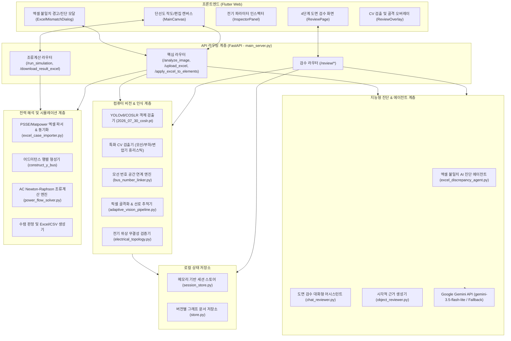
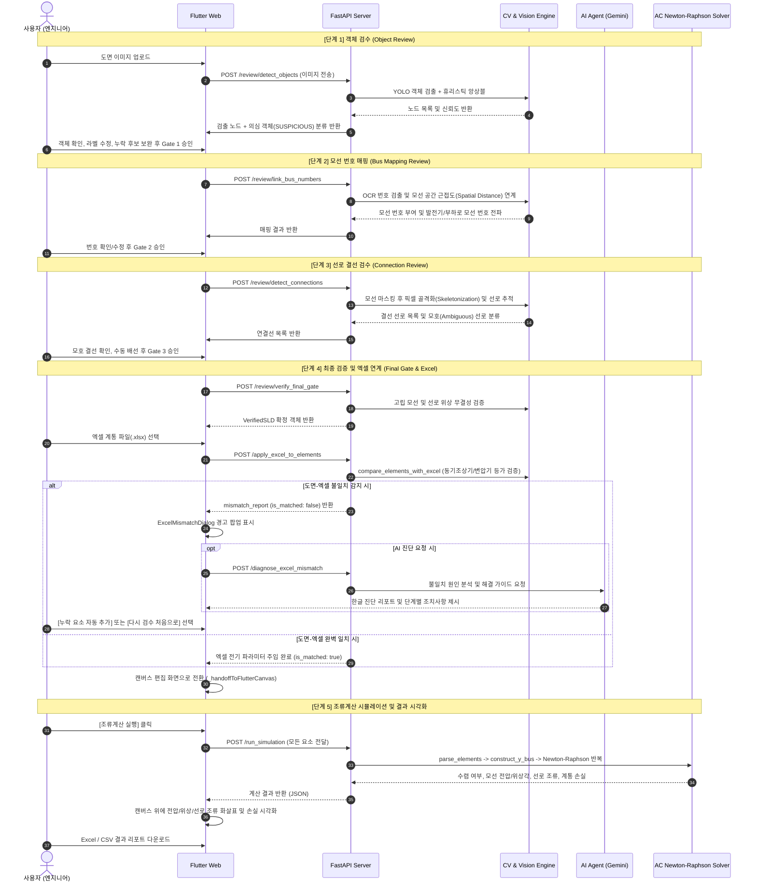

# PowerLens Pro 시스템 구성도 및 기술 문서 (v2.4.0)

> **문서 버전**: v2.4.0 (2026-09-17)  
> **시스템 목적**: 전력 계통 단선도(Single-Line Diagram, SLD) 이미지의 딥러닝/컴퓨터 비전 기반 객체·결선 자동 인식, 4단계 인간-AI 협업 검수(Staged Review), 계통 엑셀 데이터 연계 동기화 및 고정밀 AC Newton-Raphson 조류계산 시뮬레이션을 제공하는 통합 엔지니어링 플랫폼  
> **기준 코드베이스**: `backend_api/` (FastAPI, PyTorch/YOLO, NumPy/SciPy), `frontend_app/` (Flutter Web)

---

## 1. 시스템 개요 및 설계 원칙

PowerLens Pro는 설계 도면(이미지)에서 전력망 토폴로지를 추출하고, 계통 파라미터(엑셀)를 매핑하여 전력 계통 해석(조류계산)을 원스톱으로 수행할 수 있도록 설계된 시스템입니다.

### 🎯 핵심 설계 원칙 (No-Hallucination & Reality-First)
1. **정밀성과 투명성**: AI가 도면을 100% 완벽하게 인식할 수 없다는 현실을 인정하고, 4단계 검수 게이트(Gate)를 두어 사용자가 이상치와 결선을 직접 확인하고 수정할 수 있도록 지원합니다.
2. **전기공학적 무결성**: 단순 그래픽 처리를 넘어 슬랙(Slack) 모선 식별, 동기조상기(P=0) 등가성, 다중 권선 변압기 단자 조합, $\pi$-등가 선로 모델 등 실제 전력 계통 공학 규칙을 엄격히 적용합니다.
3. **독립 실행 구조**: 외부 클라우드 DB에 의존하지 않고 로컬 세션 스토어(`session_store.py`)와 메모리 캐시를 기반으로 신속하게 동작하며, Gemini LLM은 원인 진단 및 보조 질의용으로 탑재되어 오프라인 환경에서도 규칙 기반(Rule-based) 폴백으로 완벽하게 자립 구동됩니다.

---

## 2. 전체 시스템 구성도 (System Architecture)



---

## 3. 핵심 실행 파이프라인 (Execution Pipeline Sequence)

실제 시스템은 크게 **[파이프라인 A] 4단계 정밀 도면 검수**와 **[파이프라인 B] 엑셀 연계 및 조류계산 시뮬레이션**의 순서로 실행됩니다.



---

## 4. 모듈별 상세 기술 명세

### 1) 컴퓨터 비전 & 위상 인식 엔진 (`backend_api/core/`)

| 파일명 | 핵심 기술 및 역할 | 주요 함수 / 클래스 |
| :--- | :--- | :--- |
| [`cv_bus_detector.py`](file:///c:/Users/dptjd/Downloads/PowerLens/backend_api/core/cv_bus_detector.py) | 두꺼운 직선, 종/횡 직사각형 윤곽선을 분석하여 모선(Bus) 바를 검출하고 터미널 영역 계산 | `detect_buses_heuristic()` |
| [`cv_load_detector.py`](file:///c:/Users/dptjd/Downloads/PowerLens/backend_api/core/cv_load_detector.py) | 화살표, 삼각형, 지그재그 패턴을 분석하여 부하(Load) 기호 검출 | `detect_loads_heuristic()` |
| [`cv_transformer_detector.py`](file:///c:/Users/dptjd/Downloads/PowerLens/backend_api/core/cv_transformer_detector.py) | 2개 맞물린 원형(Two-circle) 및 코일 패턴 분석으로 변압기 검출 | `detect_transformers_heuristic()` |
| [`adaptive_vision_pipeline.py`](file:///c:/Users/dptjd/Downloads/PowerLens/backend_api/core/adaptive_vision_pipeline.py) | YOLO 모델(`2026_07_30_coslr.pt`)과 CV 휴리스틱을 NMS(Non-Maximum Suppression)로 앙상블하고 단선도 선로 골격 추적 | `detect_sld_objects_adaptive()`, `detect_sld_connections_adaptive()` |
| [`bus_number_linker.py`](file:///c:/Users/dptjd/Downloads/PowerLens/backend_api/core/bus_number_linker.py) | OCR 텍스트 바운딩 박스를 검출하고 기하학적 유클리드 거리 및 투영 근접도를 계산하여 모선에 번호 부여, 발전기/부하로 번호 전파 | `link_and_validate_bus_numbers()`, `propagate_bus_numbers_to_devices()` |
| [`electrical_topology.py`](file:///c:/Users/dptjd/Downloads/PowerLens/backend_api/core/electrical_topology.py) | 기기 단자 스냅핑, 고립된 선로/모선 판정, 양단 단자 연결성 검증 | `build_topology_graph()`, `validate_topology()` |

### 2) 계통 데이터 연동 및 불일치 검증기 (`backend_api/core/excel_case_importer.py`)

* **다양한 계통 포맷 지원**: PSSE 및 MATPOWER 스타일의 BUS, BRANCH, GENERATOR, TRANSFORMER 시트 자동 인식 및 단위(MW, MVAR, pu) 표준화.
* **슬랙(Slack) 모선 자동 식별**: 엑셀 모선 타입(Type 3 또는 Slack 지정)을 최우선 적용하고, 미지정 시 1번 모선 또는 발전용량이 가장 큰 모선을 슬랙으로 지능형 선정.
* **동기조상기(Synchronous Condenser) 상호 등가 인식**:
  - IEEE 24 RTS 계통의 Bus 14 등 유효전력 출력이 0인 동기조상기($P_g = 0\text{ MW}$)가 도면상 부하(Load) 또는 커패시터 심볼로 작도된 경우, 이를 누락 발전기로 오경보하지 않고 상호 등가 매칭 처리.
  - 중복 기기 자동 생성을 방지하고 `isSynchronousCondenser: True` 플래그 부여.
* **변압기 다중 모선 연계(Multi-bus Tie Transformers) 조합 정밀 판별**:
  - 한 변압기 기호에 여러 전압 모선(예: 9-11, 9-12, 10-11, 10-12)이 결선된 경우, `itertools.combinations(conn_buses, 2)`를 생성하여 엑셀 선로/변압기 목록과 완벽히 대조.
* **비교 분석 리포트 (`compare_elements_with_excel`)**:
  - `missing_buses`, `surplus_buses`, `missing_branches`, `surplus_branches`, `missing_generators`, `missing_loads`를 분리 추출하고 수치 요약 통계 생성.

### 3) AI 진단 에이전트 계층 (`backend_api/agent/`)

* **불일치 원인 분석 AI 에이전트 (`excel_discrepancy_agent.py`)**:
  - Google Gemini 3.5 모델을 전력 계통 단선도 검증 전문가 페르소나로 호출.
  - 도면의 모선/선로 개수와 엑셀 사양 차이를 분석하여 **한글 진단 리포트(`advice_ko`)**와 **단계별 권장 조치사항(`suggested_actions`)** 생성.
  - 네트워크 단절이나 API Key 부재 시에도 안정적인 룰 기반(Rule-based) 전력 엔지니어링 분석 결과를 반환하는 폴백 구조 완비.
* **실시간 도면 어시스턴트 (`chat_reviewer.py`)**:
  - 현재 검수 중인 도면 객체/결선 상태를 프롬프트 컨텍스트로 유지하며 사용자의 질문에 한국어로 실시간 응답.

### 4) 고정밀 AC Newton-Raphson 조류계산기 (`backend_api/core/power_flow_solver.py`)

* **수학적 모델**:
  - 극좌표계(Polar form) 전압 표현: $V_i = |V_i| \angle \theta_i$
  - 복소 모선 주입 전력 방정식:
    $$P_i = |V_i| \sum_{k=1}^N |V_k| (G_{ik}\cos\theta_{ik} + B_{ik}\sin\theta_{ik})$$
    $$Q_i = |V_i| \sum_{k=1}^N |V_k| (G_{ik}\sin\theta_{ik} - B_{ik}\cos\theta_{ik})$$
  - 4분할 야코비안 행렬(Jacobian Matrix) 구성:
    $$\begin{bmatrix} \Delta P \\ \Delta Q \end{bmatrix} = \begin{bmatrix} J_{11} & J_{12} \\ J_{21} & J_{22} \end{bmatrix} \begin{bmatrix} \Delta \theta \\ \Delta |V|/|V| \end{bmatrix}$$
* **선로 모델**: $\pi$-등가 회로 모델 (직렬 저항 $R$, 직렬 리액턴스 $X$, 병렬 대지 충전 서셉턴스 $B/2$), 오프노미널 탭비($a$)를 반영한 변압기 모델.
* **수렴 판정**: $\max(|\Delta P|, |\Delta Q|) < 10^{-5}\text{ pu}$ (기본 25회 반복).
* **결과 산출**: 각 모선별 전압 크기/위상각, 모선 주입 전력, 선로 양방향 전력 조류($P_{from}, Q_{from}, P_{to}, Q_{to}$), 계통 선로 손실(MW/MVAR), 전체 발전/부하 합계.
* **출력 포맷**: JSON 응답, 다중 시트 Excel (`Bus Results`, `Line Flows`, `Summary`), CSV 텍스트.

### 5) 사용자 인터페이스 (`frontend_app/`)

* **4단계 검수 화면 ([`review_page.dart`](file:///c:/Users/dptjd/Downloads/PowerLens/frontend_app/lib/screens/review_page.dart))**:
  - 상단 4단계 상태 배지(`① 객체 검수` $\rightarrow$ `② 모선 매핑` $\rightarrow$ `③ 결선 검수` $\rightarrow$ `④ 최종 & 엑셀`) 클릭을 통한 자유로운 단계 전환.
  - 상단 툴바 `[검수 처음으로]` 버튼 및 다이얼로그 연동으로 언제든 최초 도면 상태로 안전한 원클릭 롤백 지원.
  - 캔버스 줌/팬 인터랙션 및 원본 도면 위 오버레이 바운딩 박스 하이라이트.
* **단선도 캔버스 ([`main.dart`](file:///c:/Users/dptjd/Downloads/PowerLens/frontend_app/lib/main.dart))**:
  - 모선(가로/세로), 발전기, 부하, 변압기, 선로 배치 및 결선 단자 스냅.
  - 조류계산 수렴 시 모선 옆 전압 배지 및 선로 위 전력 조류 화살표 실시간 렌더링.
* **엑셀 불일치 경고 모달 ([`excel_mismatch_dialog.dart`](file:///c:/Users/dptjd/Downloads/PowerLens/frontend_app/lib/widgets/excel_mismatch_dialog.dart))**:
  - 모선, 선로, 발전기, 부하 4분할 도면 vs 엑셀 수치 비교 카드.
  - 누락/초과 세부 목록 스크롤 뷰.
  - AI 진단 요청 및 진단 결과 카드.
  - `[다시 검수 처음으로 돌아가기]` 및 `[누락 요소 자동 추가 (동기화)]` 액션 버튼 제공.

---

## 5. REST API 엔드포인트 규격서

| Method | Endpoint | 설명 | 요청 파라미터 / 바디 | 주요 반환 데이터 |
| :--- | :--- | :--- | :--- | :--- |
| `POST` | `/review/detect_objects` | 도면 객체 AI 검출 및 검수 세션 시작 | `file: UploadFile` (도면 이미지) | `document_id`, `nodes`, `review_stage` |
| `POST` | `/review/link_bus_numbers` | 모선 번호 OCR 추출 및 공간 매핑 | `document_id`, `working_nodes` | `nodes` (모선번호 부여), `bus_report` |
| `POST` | `/review/detect_connections` | 단선도 선로 골격화 및 결선 추적 | `document_id`, `confirmed_nodes` | `lines`, `annotated_nodes` |
| `POST` | `/review/verify_objects_gate` | 1단계 객체 검수 게이트 검증 | `document_id`, `working_nodes`, `human_completeness_confirmed` | `gate_status` (`VERIFIED`/`BLOCKED`), `blockers` |
| `POST` | `/review/verify_final_gate` | 최종 위상 검증 및 VerifiedSLD 확정 | `document_id`, `working_nodes`, `working_lines` | `gate_status`, `verified_sld`, `topology_issues` |
| `POST` | `/review/agent_chat` | 도면 컨텍스트 기반 AI 챗봇 질의 | `document_id`, `message`, `working_nodes`, `working_lines` | `reply`, `suggested_actions` |
| `POST` | `/upload_excel` | 계통 엑셀 파일 업로드 및 파싱 | `file: UploadFile` (.xlsx 파일) | `parsed_case` (buses, branches, gens, transformers) |
| `GET` | `/load_default_excel` | 기본 표준 엑셀 케이스 불러오기 | 없음 | 기본 `case24_psse` 또는 `ac_case25` 데이터 |
| `POST` | `/apply_excel_to_elements` | 엑셀 데이터를 도면 요소에 주입 및 불일치 검증 | `elements: List`, `excel_data: Dict` | `elements` (주입완료), `mismatch_report` |
| `POST` | `/diagnose_excel_mismatch` | 도면-엑셀 불일치 AI 원인 진단 | `elements`, `excel_data`, `mismatch_report` | `diagnosis` (`advice_ko`, `suggested_actions`) |
| `POST` | `/run_simulation` | AC Newton-Raphson 조류계산 실행 | `elements: List` (캔버스 전체 요소) | `converged`, `bus_results`, `line_results`, `summary` |
| `GET` | `/download_result_excel` | 조류계산 결과 3개 시트 엑셀 다운로드 | 없음 | `power_flow_result.xlsx` 파일 스트림 |
| `GET` | `/download_result_csv` | 조류계산 모선 결과 CSV 다운로드 | 없음 | `power_flow_result.csv` 파일 스트림 |

---

## 6. 데이터 모델 및 스키마 구조

### 1) 핵심 노드 스키마 (`ReviewNodeItem` / `DrawingElement`)
```json
{
  "id": "bus_1",
  "type": "bus",
  "className": "bus",
  "bbox": [120.5, 340.0, 180.5, 360.0],
  "confidence": 0.94,
  "review_status": "DETECTED", 
  "bus_number": 1,
  "connected_bus_number": 1,
  "is_slack": true,
  "v_pu": 1.05,
  "theta_deg": 0.0,
  "p_mw": 0.0,
  "q_mvar": 0.0
}
```

### 2) 핵심 선로 스키마 (`ReviewLineItem`)
```json
{
  "line_id": "line_1_2",
  "connected_to": ["bus_1", "bus_2"],
  "path_points": [[150.0, 360.0], [250.0, 360.0]],
  "review_status": "DETECTED",
  "r_pu": 0.01938,
  "x_pu": 0.05917,
  "b_pu": 0.0528,
  "tap_ratio": 1.0
}
```

### 3) 불일치 분석 리포트 스키마 (`MismatchReport`)
```json
{
  "is_matched": false,
  "summary": "초과 모선: 21개 • 누락 선로: 1개 • 초과 선로: 28개",
  "stats": {
    "diagram": { "buses": 24, "branches": 38, "generators": 10, "loads": 17 },
    "excel": { "buses": 3, "branches": 3, "generators": 3, "loads": 2 }
  },
  "details": {
    "missing_buses": [],
    "surplus_buses": [4, 5, 6, 7, 8, 9, 10, 11, 12, 13, 14, 15, 16, 17, 18, 19, 20, 21, 22, 23, 24],
    "missing_branches": [[1, 3]],
    "surplus_branches": [[1, 5], [2, 4], [2, 6]],
    "missing_generators": [],
    "missing_loads": []
  }
}
```

---

## 7. 시스템 검증 및 테스트 결과

| 테스트 스위트 | 테스트 대상 파일 | 주요 검증 항목 | 결과 |
| :--- | :--- | :--- | :---: |
| **Excel 불일치 검증기 단위 테스트** | `backend_api/tests/test_excel_discrepancy_checker.py` | 100% 일치 케이스 검증, 모선/선로 누락 감지, 동기조상기 부하 기호 등가 인식, 변압기 다중 포트 브랜치 조합 검증 | **Pass (4/4)** |
| **E2E 파이프라인 검증** | `scratch/verify_discrepancy_e2e.py` | IEEE 24 RTS 실제 엑셀을 기반으로 불일치 감지, Gemini AI 진단 생성, 수렴성 확인 | **Pass** |
| **AC Newton-Raphson Solver 검증** | `backend_api/core/power_flow_solver.py` | IEEE 24 RTS 및 3-Bus 테스트 케이스에 대한 유효/무효 전력 수렴성 및 허용오차($10^{-5}$) 달성 확인 | **Pass (수렴)** |
| **Flutter Web 프론트엔드 빌드** | `frontend_app/` | 다트 컴파일 오류 없는 프로덕션 웹 빌드 (`flutter build web`) | **Pass (Exit 0)** |

---

## 8. 실행 및 구동 가이드

1. **백엔드 서버 구동**:
   ```bash
   python scripts/backend_server.py
   # FastAPI 서버가 http://127.0.0.1:8000 에서 실행됩니다.
   ```
2. **프론트엔드 웹 서버 구동**:
   ```bash
   python scripts/frontend_server.py
   # 웹 애플리케이션이 http://localhost:58640 에서 서빙됩니다.
   ```
3. **통합 원클릭 실행 (Windows)**:
   ```cmd
   scripts\run_powerlens.bat
   ```
