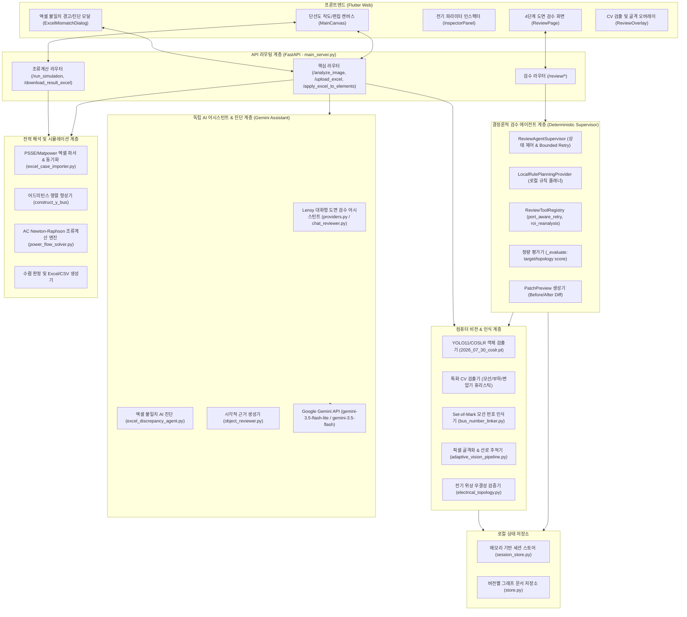
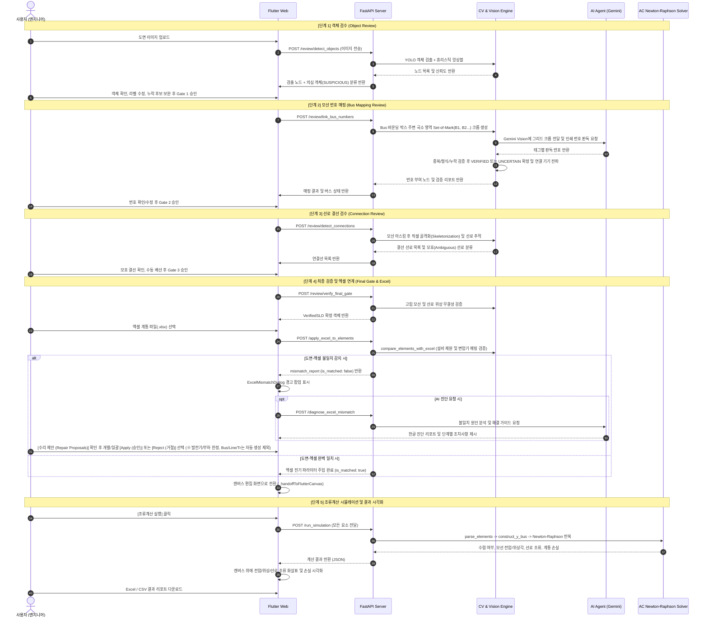

# PowerLens Pro 시스템 구성도 및 기술 문서 (v2.4.0)

> **문서 버전**: v2.4.0 (2026-09-17)  
> **시스템 목적**: 전력 계통 단선도(Single-Line Diagram, SLD) 이미지의 딥러닝/컴퓨터 비전 기반 객체·결선 자동 인식, 4단계 인간-AI 협업 검수(Staged Review), 계통 엑셀 데이터 연계 동기화 및 고정밀 AC Newton-Raphson 조류계산 시뮬레이션을 제공하는 통합 엔지니어링 플랫폼  
> **기준 코드베이스**: `backend_api/` (FastAPI, PyTorch/YOLO, NumPy/SciPy), `frontend_app/` (Flutter Web)

---

## 1. 시스템 개요 및 설계 원칙

PowerLens Pro는 설계 도면(이미지)에서 전력망 토폴로지를 추출하고, 계통 파라미터(엑셀)를 매핑하여 전력 계통 해석(조류계산)을 원스톱으로 수행할 수 있도록 설계된 시스템입니다.

### 🎯 핵심 설계 원칙 (No-Hallucination & Reality-First)
1. **정밀성과 투명성**: AI가 도면을 100% 완벽하게 인식할 수 없다는 현실을 인정하고, 4단계 검수 게이트(Gate)를 두어 사용자가 이상치와 결선을 직접 확인하고 수정할 수 있도록 지원합니다.
2. **전기공학적 무결성**: 단순 그래픽 처리를 넘어 슬랙(Slack) 모선 식별, 명시적 메타데이터 기반 동기조상기(SC) 식별, 변압기 토폴로지 매핑, $\pi$-등가 선로 모델 등 실제 전력 계통 공학 규칙을 엄격히 적용합니다.
3. **독립 실행 구조**: 외부 클라우드 DB에 의존하지 않고 로컬 세션 스토어(`session_store.py`)와 메모리 캐시를 기반으로 신속하게 동작하며, Gemini LLM은 원인 진단 및 보조 질의용으로 탑재되어 오프라인 환경에서도 규칙 기반(Rule-based) 폴백으로 완벽하게 자립 구동됩니다.

---

## 2. 전체 시스템 구성도 (System Architecture)



---

## 3. 핵심 실행 파이프라인 (Execution Pipeline Sequence)

실제 시스템은 크게 **[파이프라인 A] 4단계 정밀 도면 검수**와 **[파이프라인 B] 엑셀 연계 및 조류계산 시뮬레이션**의 순서로 실행됩니다.



---

## 4. 모듈별 상세 기술 명세

### 1) 컴퓨터 비전 & 위상 인식 엔진 (`backend_api/core/`)

| 파일명 | 핵심 기술 및 역할 | 주요 함수 / 클래스 |
| :--- | :--- | :--- |
| [`cv_bus_detector.py`](../backend_api/core/cv_bus_detector.py) | 두꺼운 직선, 종/횡 직사각형 윤곽선을 분석하여 모선(Bus) 바를 검출하고 터미널 영역 계산 | `detect_buses_heuristic()` |
| [`cv_load_detector.py`](../backend_api/core/cv_load_detector.py) | 화살표, 삼각형, 지그재그 패턴을 분석하여 부하(Load) 기호 검출 | `detect_loads_heuristic()` |
| [`cv_transformer_detector.py`](../backend_api/core/cv_transformer_detector.py) | 2개 맞물린 원형(Two-circle) 및 코일 패턴 분석으로 변압기 검출 | `detect_transformers_heuristic()` |
| [`adaptive_vision_pipeline.py`](../backend_api/core/adaptive_vision_pipeline.py) | YOLO11 모델(`2026_07_30_coslr.pt`)과 CV 휴리스틱을 NMS(Non-Maximum Suppression)로 앙상블하고 단선도 선로 골격 추적 | `detect_sld_objects_adaptive()`, `detect_sld_connections_adaptive()` |
| [`bus_number_linker.py`](../backend_api/core/bus_number_linker.py) | 모선 bbox 주변 Set-of-Mark(B1, B2...) 크롭 콜라주를 생성하고 Gemini Vision으로 인쇄 번호를 판독하여 중복/형식 검증 후 번호 부여 및 연결 기기 전파 | `link_and_validate_bus_numbers()`, `propagate_bus_numbers_to_devices()` |
| [`electrical_topology.py`](../backend_api/core/electrical_topology.py) | 기기 단자 스냅핑, 고립된 선로/모선 판정, 양단 단자 연결성 검증 | `build_topology_graph()`, `validate_topology()` |

### 2) 계통 데이터 연동 및 불일치 검증기 (`backend_api/core/excel_case_importer.py`)

* **다양한 계통 포맷 및 기준 용량(Sbase) 다중 스키마 파싱**:
  - PSSE 및 MATPOWER 스타일의 BUS, BRANCH, GENERATOR, TRANSFORMER, PARAM 시트 자동 인식.
  - Base MVA(`Sbase`) 파싱 지원: 헤더 키-값 쌍(`['sbase', '100']`), 2열 키-값 행(`['sbase', 50]`), 컬럼 하위 데이터, 단일 셀 수치 등 다양한 엑셀 서식을 유연하게 지원하며 기본값(100.0 MVA) 폴백을 제공. 단위(MW, MVAR $\rightarrow$ pu) 표준화.
* **슬랙(Slack) 모선 우선순위 결정**:
  - 1순위: 명시적 `is_slack: True` 플래그
  - 2순위: 레이블/ID에 "slack" 또는 "swing" 포함
  - 3순위: 1번 모선에 발전기 존재 시 1번 모선
  - 4순위: 1번 모선 존재 시 1번 모선
  - 5순위: 발전기가 존재하는 첫 번째 모선
  - 6순위: 전체 모선 중 첫 번째 모선 번호
* **명시적 동기조상기(Synchronous Condenser) 식별**:
  - `Pg=0`이나 `Bus 14`, `PV 모선`이라는 조건만으로 자동 판정하지 않으며, 엑셀 및 도면의 타입 속성(`type == 'sc'`, `condenser`)이나 라벨(`SC_`, `동기조상기`), 명시적 속성(`isSynchronousCondenser`) 등 명확한 메타데이터 근거가 존재할 때만 동기조상기로 식별하고 `isSynchronousCondenser: True` 플래그를 부여.
  - 도면상 부하(Load)와 발전기(Gen/SC)는 독립적인 설비로 엄격히 분리 취급되며, 부하 기호가 존재하더라도 엑셀 발전기/동기조상기를 임의로 대체 매칭하지 않고 누락 시 수리 제안(Repair Proposal)을 생성.
* **발전기/부하 수리 제안(Repair Proposals) 및 사용자 승인(Apply/Reject) 게이트**:
  - 엑셀에는 존재하지만 도면에서 미검출된 발전기 및 부하 발견 시, **캔버스와 솔버를 절대로 임의 자동 변형하지 않음**.
  - `summary['repair_proposals']`에 수리 제안(`action: suggest_add`, `reason: EXCEL_EXISTS_VISION_MISSING`)을 생성하여 UI에 전달.
  - 사용자가 UI 다이얼로그에서 명시적으로 **[Apply]**를 선택한 경우에만 해당 설비 및 리드선(`isEquipmentLead: True`)이 캔버스 요소로 추가되고 솔버에 반영됨.
  - 사용자가 **[Reject]**를 선택하거나 확인하지 않은 경우 캔버스와 솔버는 100% 도면 원래 상태를 유지.
  - **엄격한 규칙: 모선(Bus), 송전선로(Line), 변압기(Transformer)는 절대로 자동 생성하거나 보완하지 않음.**
* **서브스테이션 변압기 토폴로지 매핑 및 리드선 바이패스**:
  - 도면의 변압기 심볼과 양단 물리 리드선(`is_transformer_lead: True`, $rPu=0, xPu=0$)을 식별하여 `conn_buses`를 추출.
  - 엑셀 `transformer` 시트의 제원(`from_bus`, `to_bus`, `tap_ratio`, `tapFromBus`, $r_{pu}, x_{pu}, b_{pu}$)과 매칭하여 `electrical_branches` 단위로 매핑 (예: IEEE-24의 3-24, 9-11, 9-12, 10-11, 10-12 총 5개 브랜치).
  - 리드선은 토폴로지 증거로만 사용되며 조류계산 시 일반 송전선로 브랜치에서 제외(Bypass)하여 영임피던스($1/Z$) 발산을 원천 방지.
  - *(한계 명시: 현재 개별 심볼의 `conn_buses` 기반 매핑은 도면상 분리된 2-Port 심볼 간의 가상 교차 브랜치 자동 합성을 수행하지 않음)*
* **비교 분석 리포트 (`compare_elements_with_excel`)**:
  - `missing_buses`, `surplus_buses`, `missing_branches`, `surplus_branches`, `missing_generators`, `missing_loads`를 분리 추출하고 수치 요약 통계 생성.

### 3) 에이전트 검수 및 보조 지능 계층 (`backend_api/agent/`)

* **결정론적 검수 감독자 (`ReviewAgentSupervisor` & `LocalRulePlanningProvider`)**:
  - 외부 LLM 의존 없이 100% 로컬 규칙 기반으로 동작하는 안전한 검수 워크플로우 통제기.
  - 관측 $\rightarrow$ 규칙 플래닝 $\rightarrow$ 2개 등록 도구(`port_aware_retry`, `roi_reanalysis`) 실행 $\rightarrow$ 가상 적용 후 정량 평가(`_evaluate()`) $\rightarrow$ 2회 제한 재시도(`MAX_AGENT_ATTEMPTS=2`) $\rightarrow$ 패치 프리뷰(`PatchPreview`) $\rightarrow$ 인간 승인 게이트(Human Apply/Reject)를 통제.
  - 상세 명세는 [`AGENTIC_WORKFLOW.md`](../AGENTIC_WORKFLOW.md) 참조.
* **불일치 원인 분석 AI 에이전트 (`excel_discrepancy_agent.py`)**:
  - Google Gemini 3.5 모델(`gemini-3.5-flash-lite`)을 전력 계통 단선도 검증 전문가 페르소나로 호출.
  - 도면의 모선/선로 개수와 엑셀 사양 차이를 분석하여 **한글 진단 리포트(`advice_ko`)**와 **단계별 권장 조치사항(`suggested_actions`)** 생성.
  - 네트워크 단절이나 API Key 부재 시에도 안정적인 룰 기반(Rule-based) 전력 엔지니어링 분석 결과를 반환하는 폴백 구조 완비.
* **실시간 도면 어시스턴트 (`chat_reviewer.py` & `providers.py`)**:
  - Lensy AI: 현재 검수 중인 도면 객체/결선 상태를 프롬프트 컨텍스트로 유지하며 사용자의 질문에 한국어로 실시간 응답.
  - UI 네온 점등 타깃(`glowing_target_wrapper.dart`)을 지능적으로 추천하며, 25초 타임아웃 및 오프라인 로컬 폴백 지원.

### 4) 고정밀 AC Newton-Raphson 조류계산기 (`backend_api/core/power_flow_solver.py`)

* **수치해석 구현 및 배열 아키텍처**:
  - 고성능 **Dense NumPy 배열(`np.zeros((N, N), dtype=complex)`)** 기반 어드미턴스 행렬($Y_{\text{bus}}$) 및 야코비안 선형 연립방정식 풀이(`np.linalg.solve(J, mismatch)`). SciPy sparse 행렬이 아닌 Dense 배열 구조로 구현.
* **수학적 모델**:
  - 극좌표계(Polar form) 전압 표현: $V_i = |V_i| \angle \theta_i$
  - 복소 모선 주입 전력 방정식:
    $$P_i = |V_i| \sum_{k=1}^N |V_k| (G_{ik}\cos\theta_{ik} + B_{ik}\sin\theta_{ik})$$
    $$Q_i = |V_i| \sum_{k=1}^N |V_k| (G_{ik}\sin\theta_{ik} - B_{ik}\cos\theta_{ik})$$
  - 4분할 야코비안 행렬(Jacobian Matrix) 구성:
    $$\begin{bmatrix} \Delta P \\ \Delta Q \end{bmatrix} = \begin{bmatrix} J_{11} & J_{12} \\ J_{21} & J_{22} \end{bmatrix} \begin{bmatrix} \Delta \theta \\ \Delta |V| \end{bmatrix}$$
* **선로 및 오프노미널 변압기 모델**:
  - $\pi$-등가 회로 모델: 직렬 임피던스 $z = r + jx$, 어드미턴스 $y = 1/z$, 대지 충전 서셉턴스 $y_{sh} = j b/2$.
  - 변압기 오프노미널 탭비($a$) 모델링:
    $$Y_{ii} \mathrel{+}= \frac{y + y_{sh}}{a^2}, \quad Y_{jj} \mathrel{+}= y + y_{sh}, \quad Y_{ij} = Y_{ji} = -\frac{y}{a}$$
* **수렴 판정**: $\max(|\Delta P|, |\Delta Q|) < 10^{-4}\text{ pu}$ (기본 25회 반복).
* **결과 산출**: 각 모선별 전압 크기/위상각, 모선 주입 전력, 선로 양방향 전력 조류($P_{from}, Q_{from}, P_{to}, Q_{to}$), 계통 선로 손실(MW/MVAR), 전체 발전/부하 합계.
* **출력 포맷**: JSON 응답, 다중 시트 Excel (`Bus Results`, `Line Flows`, `Summary`), CSV 텍스트.
* **엔지니어링 한계 사항 (Limitations)**:
  - 현재 솔버는 발전기 무효전력 상하한($Q_{\min}, Q_{\max}$) 초과 감지 시 PV 모선을 PQ 모선으로 동적 전환하는 PV-PQ 버스 스위칭 로직은 미포함 상태입니다.

### 5) 사용자 인터페이스 (`frontend_app/`)

* **4단계 검수 화면 ([`review_page.dart`](../frontend_app/lib/screens/review_page.dart))**:
  - 상단 4단계 상태 배지(`① 객체 검수` $\rightarrow$ `② 모선 매핑` $\rightarrow$ `③ 결선 검수` $\rightarrow$ `④ 최종 & 엑셀`) 클릭을 통한 자유로운 단계 전환.
  - 상단 툴바 `[검수 처음으로]` 버튼 및 다이얼로그 연동으로 언제든 최초 도면 상태로 안전한 원클릭 롤백 지원.
  - 캔버스 줌/팬 인터랙션 및 원본 도면 위 오버레이 바운딩 박스 하이라이트.
* **단선도 캔버스 ([`main.dart`](../frontend_app/lib/main.dart))**:
  - 모선(가로/세로), 발전기, 부하, 변압기, 선로 배치 및 결선 단자 스냅.
  - 조류계산 수렴 시 모선 옆 전압 배지 및 선로 위 전력 조류 화살표 실시간 렌더링.
* **엑셀 불일치 경고 모달 ([`excel_mismatch_dialog.dart`](../frontend_app/lib/widgets/excel_mismatch_dialog.dart))**:
  - 모선, 선로, 발전기, 부하 4분할 도면 vs 엑셀 수치 비교 카드.
  - 누락/초과 세부 목록 스크롤 뷰.
  - 도면 미검출 발전기/부하에 대한 **수리 제안(Repair Proposal) 카드** 및 개별/일괄 **[Apply (적용)] / [Reject (거절)]** 버튼 제공.
  - 모선, 송전선로, 변압기는 자동 생성 불가 안내 및 도면 검수 단계 재진입 가이드 제공.
  - AI 진단 요청 및 진단 결과 카드.

---

## 5. REST API 엔드포인트 규격서

| Method | Endpoint | 설명 | 요청 파라미터 / 바디 | 주요 반환 데이터 |
| :--- | :--- | :--- | :--- | :--- |
| `POST` | `/review/detect_objects` | 도면 객체 AI 검출 및 검수 세션 시작 | `file: UploadFile` (도면 이미지) | `document_id`, `nodes`, `review_stage` |
| `POST` | `/review/link_bus_numbers` | Set-of-Mark + Gemini Vision 기반 모선 번호 인식 및 검증 | `document_id`, `working_nodes` | `nodes` (모선번호 부여), `bus_report` |
| `POST` | `/review/detect_connections` | 단선도 선로 골격화 및 결선 추적 | `document_id`, `confirmed_nodes` | `lines`, `annotated_nodes` |
| `POST` | `/review/verify_objects_gate` | 1단계 객체 검수 게이트 검증 | `document_id`, `working_nodes`, `human_completeness_confirmed` | `gate_status` (`VERIFIED`/`BLOCKED`), `blockers` |
| `POST` | `/review/verify_final_gate` | 최종 위상 검증 및 VerifiedSLD 확정 | `document_id`, `working_nodes`, `working_lines` | `gate_status`, `verified_sld`, `topology_issues` |
| `POST` | `/review/agent_chat` | 도면 컨텍스트 기반 AI 검토 도우미 질의 | `document_id`, `message`, `working_nodes`, `working_lines` | `reply_ko`, `agent_status`, `context_summary` |
| `POST` | `/upload_excel` | 계통 엑셀 파일 업로드 및 파싱 | `file: UploadFile` (.xlsx 파일) | `parsed_case` (buses, branches, gens, transformers) |
| `GET` | `/load_default_excel` | 기본 표준 엑셀 케이스 불러오기 | 없음 | 기본 `case24_psse` 또는 `ac_case25` 데이터 |
| `POST` | `/apply_excel_to_elements` | 엑셀 데이터를 도면 요소에 주입 및 불일치 검증 | `elements: List`, `excel_data: Dict` | `elements` (주입완료), `mismatch_report` |
| `POST` | `/diagnose_excel_mismatch` | 도면-엑셀 불일치 AI 원인 진단 | `elements`, `excel_data`, `mismatch_report` | `diagnosis` (`advice_ko`, `suggested_actions`) |
| `POST` | `/run_simulation` | AC Newton-Raphson 조류계산 실행 | `elements: List` (캔버스 전체 요소) | `converged`, `bus_results`, `line_results`, `summary` |
| `GET` | `/download_result_excel` | 조류계산 결과 3개 시트 엑셀 다운로드 | 없음 | `power_flow_result.xlsx` 파일 스트림 |
| `GET` | `/download_result_csv` | 조류계산 모선 결과 CSV 다운로드 | 없음 | `power_flow_result.csv` 파일 스트림 |

---

## 6. 데이터 모델 및 스키마 구조

### 1) 핵심 노드 스키마 (`ReviewNodeItem` / `DrawingElement`)
```json
{
  "id": "bus_1",
  "type": "bus",
  "className": "bus",
  "bbox": [120.5, 340.0, 180.5, 360.0],
  "confidence": 0.94,
  "review_status": "DETECTED", 
  "bus_number": 1,
  "connected_bus_number": 1,
  "is_slack": true,
  "v_pu": 1.05,
  "theta_deg": 0.0,
  "p_mw": 0.0,
  "q_mvar": 0.0
}
```

### 2) 핵심 선로 스키마 (`ReviewLineItem`)
```json
{
  "line_id": "line_1_2",
  "connected_to": ["bus_1", "bus_2"],
  "path_points": [[150.0, 360.0], [250.0, 360.0]],
  "review_status": "DETECTED",
  "r_pu": 0.01938,
  "x_pu": 0.05917,
  "b_pu": 0.0528,
  "tap_ratio": 1.0
}
```

### 3) 불일치 분석 리포트 스키마 (`MismatchReport`)
```json
{
  "is_matched": false,
  "summary": "초과 모선: 21개 • 누락 선로: 1개 • 초과 선로: 28개",
  "stats": {
    "diagram": { "buses": 24, "branches": 38, "generators": 10, "loads": 17 },
    "excel": { "buses": 3, "branches": 3, "generators": 3, "loads": 2 }
  },
  "details": {
    "missing_buses": [],
    "surplus_buses": [4, 5, 6, 7, 8, 9, 10, 11, 12, 13, 14, 15, 16, 17, 18, 19, 20, 21, 22, 23, 24],
    "missing_branches": [[1, 3]],
    "surplus_branches": [[1, 5], [2, 4], [2, 6]],
    "missing_generators": [],
    "missing_loads": []
  }
}
```

---

## 7. 시스템 검증 및 테스트 결과

| 테스트 스위트 | 테스트 대상 파일 | 주요 검증 항목 | 결과 |
| :--- | :--- | :--- | :---: |
| **전기 파라미터 무결성 테스트** | `backend_api/tests/test_electrical_parameters_and_fallbacks.py` | 임의의 R/X/B fallback 배제, 제로 임피던스 $1/Z$ 발산 방지, 미정의 선로 사전 차단 | **Pass (10/10)** |
| **일반화 회로 및 변압기 테스트** | `backend_api/tests/test_generalized_circuits_and_transformers.py` | 복회선 병렬 합성, 변압기 리드선 바이패스, 탭비 방향 보존 | **Pass (7/7)** |
| **변압기 토폴로지 해석 테스트** | `backend_api/tests/test_transformer_topology_resolution.py` | 5개 변압기 브랜치(3-24, 9-11, 9-12, 10-11, 10-12) 매핑 및 $Y_{\text{bus}}$ 스탬핑 | **Pass (7/7)** |
| **Excel 케이스 파서 테스트** | `backend_api/tests/test_excel_case_importer.py` | PSSE/Matpower 시트 파싱, 다중 Sbase(100/50/200/KV) 파싱, 슬랙 탐색 | **Pass (9/9)** |
| **발전기/부하 수리 제안 검증** | `backend_api/tests/test_excel_generator_auto_supplement.py` | 도면 미검출 발전기/부하 수리제안 생성, 사용자 Apply/Reject 게이트, Bus/Line/Tr 자동생성 제외 | **Pass (10/10)** |
| **Excel 불일치 검증기 단위 테스트** | `backend_api/tests/test_excel_discrepancy_checker.py` | 100% 일치 케이스 검증, 모선/선로 누락 감지, 부하/발전기 독립성 및 누락 수리제안 검증 | **Pass (4/4)** |
| **AC Newton-Raphson Solver 검증** | `backend_api/tests/test_power_flow_solver.py` | IEEE 24 RTS 및 3-Bus 케이스에 대한 4회 반복 수렴 및 전력수지 보존 검증 | **Pass (10/10)** |
| **Flutter Web 프론트엔드 빌드** | `frontend_app/` | 다트 컴파일 오류 없는 프로덕션 웹 빌드 (`flutter build web`) | **Pass (Exit 0)** |

---

## 8. 실행 및 구동 가이드

1. **원클릭 통합 실행 (가장 쉬운 방법 ⚡)**:
   ```cmd
   run.bat
   # 또는
   python scripts\run_powerlens.py
   ```
2. **개별 백엔드 서버 구동 (포트 8000)**:
   ```bash
   python backend_api/main_server.py
   # FastAPI 서버가 http://127.0.0.1:8000 에서 실행됩니다. (Swagger: /docs)
   ```
3. **개별 프론트엔드 프로덕션 웹 서빙 (포트 58640)**:
   ```bash
   python -m http.server 58640 --directory frontend_app/build/web
   # 웹 애플리케이션이 http://localhost:58640 에서 서빙됩니다.
   ```
